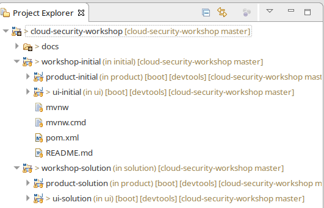
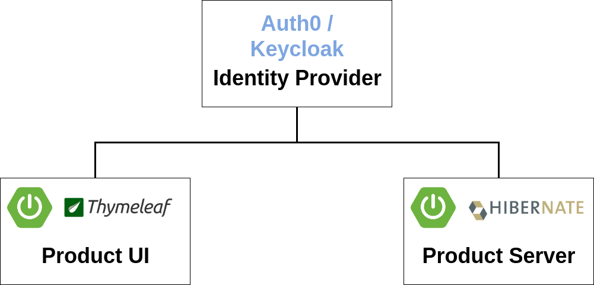
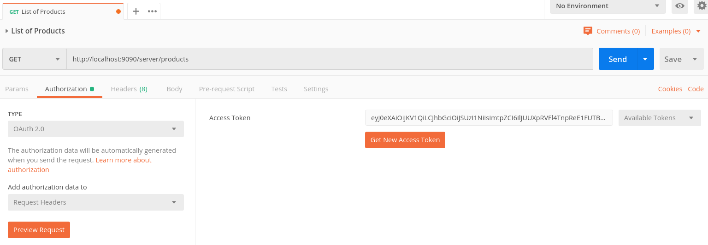
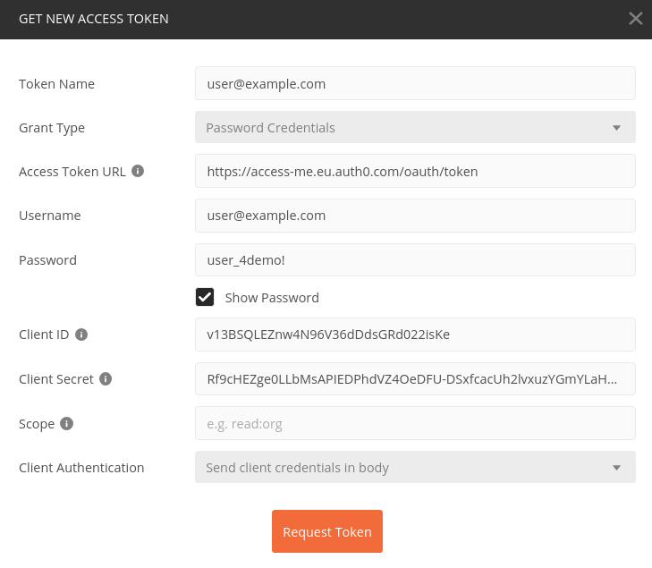

[][1]
[](https://travis-ci.org/andifalk/cloud-security-workshop)

- [Cloud Security Workshop](#cloud-security-workshop)
  * [Setup](#setup)
    + [System Requirements](#system-requirements)
    + [Import the project into your IDE](#import-the-project-into-your-ide)
  * [Project contents](#project-contents)
  * [OAuth 2.0/OpenID Connect Security Workshop Tutorial](#oauth-20-openid-connect-security-workshop-tutorial)
    + [Resource Server (Products)](#resource-server--products-)
      - [Step 1: Change Maven dependencies](#step-1--change-maven-dependencies)
      - [Step 2: Add required properties](#step-2--add-required-properties)
      - [Step 3: Change security configuration](#step-3--change-security-configuration)
      - [Step 4: Convert the JWT into the ProductUser](#step-4--convert-the-jwt-into-the-productuser)
      - [Step 5: Run the application](#step-5--run-the-application)
    + [Client (UI)](#client--ui-)
      - [Step 1: Change Maven dependencies](#step-1--change-maven-dependencies-1)
      - [Step 2: Add required properties](#step-2--add-required-properties-1)
      - [Step 3: Add OAuth2/OIDC client security configuration](#step-3--add-oauth2-oidc-client-security-configuration)
      - [Step 4: Update the call to the resource server](#step-4--update-the-call-to-the-resource-server)

# Cloud Security Workshop
Workshop on building secure cloud-native applications using spring cloud security (OAuth 2.0 and OpenID Connect)

This workshop is the hands-on part of the cloud security presentation.

## Setup

### System Requirements

* Version 11 of the [Java SDK](https://adoptopenjdk.net/), version 13 might also work but is not tested
* A Java IDE (like [Eclipse](https://www.eclipse.org/downloads/), [SpringToolSuite](https://spring.io/tools), [IntelliJ](https://www.jetbrains.com/idea/download), [Visual Studio Code](https://code.visualstudio.com/))
* [Postman](https://www.getpostman.com/downloads/) to test requests to the REST Api

### Import the project into your IDE

1. Clone the git repository https://github.com/andifalk/cloud-security-workshop or download it as zip file
2. Import the whole directory into your Java IDE as __Maven__ project
  * IntelliJ: File/New/Project from existing sources -> Select directory -> Select __Maven__ in next step
  * Eclipse: File/Import -> Select '__Maven__'/'__Existing Maven Projects__' -> Select directory -> Click 'Finish'
  * Visual Studio Code: Just open the directory with VS Code -> VS Code should automatically configure the project
3. You might have to explicitly trigger an update for the maven configuration to load dependencies (depending on your IDE)

## Project contents

After importing the project into your IDE you should see a project structure like in the following picture
(here the Eclipse project is shown, it may look different in other IDE's).



Basically you find 2 top level folders:

* workshop-initial: This will be the starting point to implement code as part of this workshop
    - product-initial: This is the provided sample product server microservice
    - ui-initial: This is the provided sample product ui client microservice
* workshop-solution: This is the reference solution for this workshop (please do NOT look into this now)
    - product-solution: This is the reference solution of a OAuth2/OIDC product server microservice
    - ui-solution: This is the reference solution of a OAuth2/OIDC product ui client microservice


## OAuth 2.0/OpenID Connect Security Workshop Tutorial

We will extend the existing two microservices to use single sign authentication based on OAuth 2.0 and OpenID Connect (OIDC).

* __Auth0 Identity Provider__: This is central identity provider for single sign on which holds all users with their credentials
* __OAuth2/OIDC Resource Server (product-initial)__: The microservice providing product data maps to a resource server
* __OAuth2/OIDC Client (ui-initial)__: The thymeleaf UI microservice consuming the products maps to an OAuth2/OIDC client



These microservices have to be configured to be reachable via the following URL addresses (Port 8080 is the default port in spring boot).

Service URL Adresses

|Service                     |URL                              |
|----------------------------|---------------------------------|
|Identity Provider           |https://access-me.eu.auth0.com   |
|Client (UI)                 |http://localhost:9095/client     |
|Resource Server (Products)  |http://localhost:9090/server     |

__Note:__  
You can find more information on building OAuth 2.0/OIDC secured microservices with spring in
[Spring Boot Reference Documentation](https://docs.spring.io/spring-boot/docs/current/reference/htmlsingle/#boot-features-security-oauth2)
and in [Spring Security Reference Documentation](https://docs.spring.io/spring-security/site/docs/current/reference/htmlsingle/#oauth2)

So let's start with implementing the server side: The resource server.

### Resource Server (Products)

__Tip__:  
You may look into the [Spring Boot Reference Documentation](https://docs.spring.io/spring-boot/docs/current/reference/htmlsingle/#boot-features-security-oauth2-server)
 and the [Spring Security Reference Documentation](https://docs.spring.io/spring-security/site/docs/current/reference/htmlsingle/#oauth2resourceserver) on how to implement a resource server.

#### Step 1: Change Maven dependencies

The existing product server is using the base spring security
lib to secure its endpoints using basic authentication and
form login.

To change these existing authentication machanisms to JWT authentication as a resource server we need to adapt the spring security dependencies, i.e. use the corresponding one for building a secure OAuth2/OIDC resource server instead of simple
basic authentication.

To perform this required change replace the following dependency in the existing maven _pom.xml_ file:

<u>_pom.xml_:</u>
```xml
<dependency>
    <groupId>org.springframework.boot</groupId>
    <artifactId>spring-boot-starter-security</artifactId>
</dependency>
```

with this new dependency:

<u>_pom.xml_:</u>
```xml
<dependency>
    <groupId>org.springframework.boot</groupId>
    <artifactId>spring-boot-starter-oauth2-resource-server</artifactId>
</dependency>
```

#### Step 2: Add required properties

The resource server requires the public key(s) to validate the signature of incoming JSON web tokens (JWT). This way nobody can
just issue hier/her own JWT tokens or modify the issued token along the transmission path.
The public key(s) will be automatically grabbed from the JSON web key set provided by the
identity provider at https://access-me.eu.auth0.com/.well-known/jwks.json.

Spring security provides a predefined property ```spring.security.oauth2.resourceserver.jwt.jwt-set-uri``` 
to specify this.

After adding this new property the updated _application.yml_ should look like this:

<u>_application.yml_:</u>

```yaml
spring:
  jpa:
    open-in-view: false
  security:
    oauth2:
      resourceserver:
        jwt:
          jwk-set-uri: https://access-me.eu.auth0.com/.well-known/jwks.json
```

__Important:__  
Please check that all indents are correct. Otherwise you may get strange runtime errors when starting
the application.

#### Step 3: Change security configuration

<u>_com.example.security.WebSecurityConfiguration.java_:</u>

```java
package com.example.security;

import org.springframework.beans.factory.annotation.Autowired;
import org.springframework.context.annotation.Configuration;
import org.springframework.security.config.annotation.method.configuration.EnableGlobalMethodSecurity;
import org.springframework.security.config.annotation.web.builders.HttpSecurity;
import org.springframework.security.config.annotation.web.configuration.EnableWebSecurity;
import org.springframework.security.config.annotation.web.configuration.WebSecurityConfigurerAdapter;
import org.springframework.security.config.http.SessionCreationPolicy;

@EnableGlobalMethodSecurity(prePostEnabled = true)
@EnableWebSecurity
@Configuration
public class WebSecurityConfiguration extends WebSecurityConfigurerAdapter {

  @Override
  protected void configure(HttpSecurity http) throws Exception {
    http.csrf()
        .disable()
        .sessionManagement()
        .sessionCreationPolicy(SessionCreationPolicy.STATELESS)
        .and()
        .httpBasic()
        .disable()
        .formLogin()
        .disable()
        .authorizeRequests()
        .anyRequest()
        .fullyAuthenticated()
        .and()
        .oauth2ResourceServer()
        .jwt();
  }
}
```

In this updated security configuration we

* disable web sessions as with token authentication each request must contain the token in the header and a session cookie is not required any more 
* disable [CSRF]() protection as we do not use session cookies any more and therefore are not vulnerable for CSRF attacks
* disable basic authentication and formular based login
* enable the application to act as an OAuth2/OIDC resource server requiring JWT tokens in the _authorization_ header

Please note that the bean definition for the ```PasswordEncoder``` has been removed as well as the password encoding
is not required any more.
This will cause compilation errors in ```ProductInitializer``` class. To solve these just remove all references to the encoder.

<u>_com.example.ProductInitializer.java_:</u>

```java
package com.example;

import com.example.product.Product;
import com.example.product.ProductRepository;
import com.example.productuser.ProductUser;
import com.example.productuser.ProductUserRepository;
import org.slf4j.Logger;
import org.slf4j.LoggerFactory;
import org.springframework.boot.CommandLineRunner;
import org.springframework.stereotype.Component;

import java.util.Collections;
import java.util.stream.Stream;

/** Initializes some products in database. */
@Component
public class ProductInitializer implements CommandLineRunner {
  private static final Logger LOG = LoggerFactory.getLogger(ProductInitializer.class.getName());

  private final ProductRepository productRepository;
  private final ProductUserRepository productUserRepository;

  public ProductInitializer(
      ProductRepository productRepository, ProductUserRepository productUserRepository) {
    this.productRepository = productRepository;
    this.productUserRepository = productUserRepository;
  }

  @Override
  public void run(String... strings) {
    Stream.of(
            new Product("Apple", "A green apple", 3.50),
            new Product("Banana", "The perfect banana", 7.00),
            new Product("Orange", "Lots of sweet oranges", 33.00),
            new Product("Pineapple", "Exotic pineapple", 1.50),
            new Product("Grapes", "Red wine grapes", 10.75))
        .forEach(productRepository::save);

    LOG.info("Created " + productRepository.count() + " products");

    Stream.of(
            new ProductUser(
                "auth0|5bc44fceb144eb0173391741",
                "Uwe",
                "User",
                "n/a",
                "user@example.com",
                Collections.singletonList("USER")),
            new ProductUser(
                "auth0|5bc4b1553385d56f61f70e3b",
                "Alex",
                "Admin",
                "n/a",
                "admin@example.com",
                Collections.singletonList("ADMIN")))
        .forEach(productUserRepository::save);

    LOG.info("Created " + productUserRepository.count() + " users");
  }
}
```

#### Step 4: Convert the JWT into the ProductUser

With the changes of step 3 the base configuration for a resource server is set up.
But there is one issue with this change.
In class ```com.example.product.ProductRestController``` we do not get _ProductUser_ as input for _@AuthenticationPrincipal_, instead by default the class _org.springframework.security.oauth2.jwt.Jwt_ will be provided as input. 

```  
@RestController
public class ProductRestController {
  ...
  @GetMapping(path = "/products")
  public List<Product> getAllProducts(@AuthenticationPrincipal(errorOnInvalidType = true) ProductUser productUser) {
    ...
  }
}
``` 

To change this behavior we have to add our own converter from the JWT token to the _ProductUser_ class.
This is done in several steps.

First we need to define our own type for _AuthenticationToken_. This is the central point where Spring Security stores all
authentication details after authentication has been successfully performed.

<u>_com.example.security.ProductUserAuthenticationToken_:</u>

```java
package com.example.security;

import com.example.productuser.ProductUser;
import org.springframework.security.authentication.AbstractAuthenticationToken;
import org.springframework.security.core.GrantedAuthority;

import java.util.Collection;

public class ProductUserAuthenticationToken extends AbstractAuthenticationToken {

  private final ProductUser productUser;

  public ProductUserAuthenticationToken( ProductUser productUser, Collection<? extends GrantedAuthority> authorities) {
    super(authorities);
    setAuthenticated(true);
    this.productUser = productUser;
  }

  @Override
  public Object getCredentials() {
    return "n/a";
  }

  @Override
  public Object getPrincipal() {
    return this.productUser;
  }
}
```

The previous class will now be used as part of the _ProductJwtAuthenticationConverter_.
This converts contents of the JWT token into attributes of our _ProductUser_.

<u>_com.example.security.ProductJwtAuthenticationConverter_:</u>

```java
package com.example.security;

import com.example.productuser.ProductUser;
import org.springframework.beans.factory.annotation.Autowired;
import org.springframework.core.convert.converter.Converter;
import org.springframework.security.authentication.AbstractAuthenticationToken;
import org.springframework.security.core.userdetails.UserDetails;
import org.springframework.security.core.userdetails.UserDetailsService;
import org.springframework.security.oauth2.jwt.Jwt;
import org.springframework.stereotype.Component;

@Component
public class ProductJwtAuthenticationConverter implements Converter<Jwt, AbstractAuthenticationToken> {

  private final UserDetailsService userDetailsService;

  @Autowired
  public ProductJwtAuthenticationConverter(UserDetailsService userDetailsService) {
    this.userDetailsService = userDetailsService;
  }

  @Override
  public AbstractAuthenticationToken convert(Jwt jwt) {
    UserDetails userDetails = userDetailsService.loadUserByUsername(jwt.getSubject());
    if (userDetails instanceof ProductUser) {
      return new ProductUserAuthenticationToken((ProductUser) userDetails, userDetails.getAuthorities());
    } else {
      return null;
    }
  }
}
```

Also the existing _ProductUserDetailsService_ class has to be changed because now we will use
the attribute _userid_ to identify the user in our database instead of _email_. The user id is given to us as _subject_ claim inside the JWT token.

<u>_com.example.security.ProductUserDetailsService_:</u>

```java
package com.example.security;

import com.example.productuser.ProductUser;
import com.example.productuser.ProductUserService;
import org.springframework.beans.factory.annotation.Autowired;
import org.springframework.context.annotation.Primary;
import org.springframework.security.core.userdetails.UserDetails;
import org.springframework.security.core.userdetails.UserDetailsService;
import org.springframework.security.core.userdetails.UsernameNotFoundException;
import org.springframework.stereotype.Service;

@Primary
@Service
public class ProductUserDetailsService implements UserDetailsService {

  private final ProductUserService productUserService;

  @Autowired
  public ProductUserDetailsService(ProductUserService productUserService) {
    this.productUserService = productUserService;
  }

  @Override
  public UserDetails loadUserByUsername(String username) throws UsernameNotFoundException {
    ProductUser user = productUserService.findByUserId(username);
    if (user == null) {
      throw new UsernameNotFoundException(
          "No user could be found for user name '" + username + "'");
    }

    return user;
  }
}
```

Finally we have to add this new _ProductJwtAuthenticationConverter_ to our security configuration.

<u>_com.example.security.WebSecurityConfiguration.java_:</u>

```java
package com.example.security;

import org.springframework.beans.factory.annotation.Autowired;
import org.springframework.context.annotation.Configuration;
import org.springframework.security.config.annotation.method.configuration.EnableGlobalMethodSecurity;
import org.springframework.security.config.annotation.web.builders.HttpSecurity;
import org.springframework.security.config.annotation.web.configuration.EnableWebSecurity;
import org.springframework.security.config.annotation.web.configuration.WebSecurityConfigurerAdapter;
import org.springframework.security.config.http.SessionCreationPolicy;

@EnableGlobalMethodSecurity(prePostEnabled = true)
@EnableWebSecurity
@Configuration
public class WebSecurityConfiguration extends WebSecurityConfigurerAdapter {

  private final ProductJwtAuthenticationConverter productJwtAuthenticationConverter;

  @Autowired
  public WebSecurityConfiguration(ProductJwtAuthenticationConverter productJwtAuthenticationConverter) {
    this.productJwtAuthenticationConverter = productJwtAuthenticationConverter;
  }

  @Override
  protected void configure(HttpSecurity http) throws Exception {
    http.csrf()
        .disable()
        .sessionManagement()
        .sessionCreationPolicy(SessionCreationPolicy.STATELESS)
        .and()
        .httpBasic()
        .disable()
        .formLogin()
        .disable()
        .authorizeRequests()
        .anyRequest()
        .fullyAuthenticated()
        .and()
        .oauth2ResourceServer()
        .jwt().jwtAuthenticationConverter(productJwtAuthenticationConverter);
  }
}
```

#### Step 5: Run the application

Now we are ready to start the product server.
Select the class _com.example.ProductApplication_ and run this (use the right mouse button in your IDE or the spring boot dashboard if applicable).

To test the REST Api (http://localhost:9090/server/products) of the running product server we will use
Postman. You may also use command line tools like _curl_ or _httpie_ as well.

After starting Postman you can create a new collection by clicking the button _New Collection_ on the left.
Then you can add a new request by clicking the 3 dots next to the collection and select _Add Request_.

Just fill in the URL you see in the picture below.



If you now click send then you will get a 401 error because
the JWT token is missing to access this endpoint.

To get such a token navigate to the tab _Authorization_ on the request screen and click on the _Get New Access Token_ button.
Then you will see a dialog as shown in the picture below.



Just fill in the required values from the table below and then click on _Request Token_:

|Input             |Value                                                             |
|------------------|------------------------------------------------------------------|
|Grant Type        |Password Credentials                                              |
|Access Token URL  |https://access-me.eu.auth0.com/oauth/token                        |
|Username          |user@example.com                                                  |
|Password          |user_4demo!                                                       |
|Client ID         |v13BSQLEZnw4N96V36dDdsGRd022isKe                                  |
|Client Secret     |Rf9cHEZge0LLbMsAPIEDPhdVZ4OeDFU-DSxfcacUh2lvxuzYGmYLaH54ZX1-cmNL  |

After you got a token you can close this dialog and try again to send the request.
This time it should work and you should see a list of products as JSON response.

### Client (UI)

__Tip__:  
You may look into the [Spring Boot Reference Documentation](https://docs.spring.io/spring-boot/docs/current/reference/htmlsingle/#boot-features-security-oauth2-client)
 and the [Spring Security Reference Documentation](https://docs.spring.io/spring-security/site/docs/current/reference/htmlsingle/#oauth2client) on how to implement a client.

#### Step 1: Change Maven dependencies

Replace the following dependency in the existing maven _pom.xml_ file:

<u>_pom.xml_:</u>
```xml
<dependency>
    <groupId>org.springframework.boot</groupId>
    <artifactId>spring-boot-starter-security</artifactId>
</dependency>
```

with the following new dependency:

<u>_pom.xml_:</u>
```xml
<dependency>
    <groupId>org.springframework.boot</groupId>
    <artifactId>spring-boot-starter-oauth2-client</artifactId>
</dependency>
```

#### Step 2: Add required properties

The resource server requires the public key(s) to validate the signature of incoming 
JSON web tokens (JWT). The key(s) will be automatically grabbed from the JSON web key set provided by the
identity provider at https://access-me.eu.auth0.com/.well-known/jwks.json.

Spring security provides predefined properties to configure the application as an OAuth2/OIDC client:

* The property ```spring.security.oauth2.client.provider.auth0.issuer-uri``` specifies 
the URI for loading the required configuration to setup an OAuth2/OIDC client for the _Auth0_ 
identity provider.
* The property ```spring.security.oauth2.client.registration.auth0.client-id``` specifies 
the _client id_ as it is has been registered at the _Auth0_ identity provider.
* The property ```spring.security.oauth2.client.registration.auth0.client-secret``` specifies 
the _client secret_ to authorize the application to act as a registered at the _Auth0_ identity provider.
* The property ```spring.security.oauth2.client.registration.auth0.authorizationGrantType``` specifies 
which OAuth2/OIDC grant flow should be used for the client.
* The property ```spring.security.oauth2.client.registration.auth0.redirect-uri``` specifies 
the redirect URI to call our client application with the authorization code 
from the _Auth0_ identity provider. Spring also provides predefined placeholders for the base url and the registration id.

After adding the required new properties the updated _application.yml_ should look like this:

<u>_application.yml_:</u>
```yaml
spring:
  security:
    oauth2:
      client:
        provider:
          auth0:
            issuer-uri: https://access-me.eu.auth0.com/
        registration:
          auth0:
            client-id: 'v13BSQLEZnw4N96V36dDdsGRd022isKe'
            client-secret: 'Rf9cHEZge0LLbMsAPIEDPhdVZ4OeDFU-DSxfcacUh2lvxuzYGmYLaH54ZX1-cmNL'
            authorizationGrantType: authorization_code
            redirect-uri: '{baseUrl}/login/oauth2/code/{registrationId}'
```

__Important:__  
Please check that all indents are correct. Otherwise you may get strange runtime errors when starting
the application.

#### Step 3: Add OAuth2/OIDC client security configuration 


<u>_com/example/WebSecurityConfiguration.java_:</u>

```
package com.example;

import org.springframework.context.annotation.Configuration;
import org.springframework.security.config.annotation.web.builders.HttpSecurity;
import org.springframework.security.config.annotation.web.configuration.EnableWebSecurity;
import org.springframework.security.config.annotation.web.configuration.WebSecurityConfigurerAdapter;

import static org.springframework.security.config.Customizer.withDefaults;

@EnableWebSecurity
@Configuration
public class WebSecurityConfiguration extends WebSecurityConfigurerAdapter {

  @Override
  protected void configure(HttpSecurity http) throws Exception {
    http
            .authorizeRequests(authorizeRequests ->
                    authorizeRequests
                            .anyRequest().authenticated()
            )
            .oauth2Client().and()
            .oauth2Login(withDefaults());
  }
}
```

#### Step 4: Update the call to the resource server

<u>_com/example/ProductService.java_:</u>

```java
package com.example;

import org.springframework.http.HttpEntity;
import org.springframework.http.HttpHeaders;
import org.springframework.http.HttpMethod;
import org.springframework.http.ResponseEntity;
import org.springframework.security.oauth2.core.OAuth2AccessToken;
import org.springframework.stereotype.Service;
import org.springframework.web.client.RestTemplate;

import java.util.Arrays;
import java.util.Collection;
import java.util.Collections;

@Service
public class ProductService {

  public Collection<Product> getAllProducts(OAuth2AccessToken oAuth2AccessToken) {

    RestTemplate template = new RestTemplate();

    ResponseEntity<Product[]> response =
            template.exchange(
                    "http://localhost:9090/server/products",
                    HttpMethod.GET,
                    new HttpEntity<Product[]>(createAuthorizationHeader(oAuth2AccessToken)),
                    Product[].class);

    if (response.getBody() != null) {
      return Arrays.asList(response.getBody());
    } else {
      return Collections.emptyList();
    }
  }

  private HttpHeaders createAuthorizationHeader(OAuth2AccessToken oAuth2AccessToken) {
    return new HttpHeaders() {
      {
        String authHeader = "Bearer " + oAuth2AccessToken.getTokenValue();
        set("Authorization", authHeader);
      }
    };
  }
}
```

<u>_com/example/ProductController_:</u>

```java
package com.example;

import org.springframework.beans.factory.annotation.Autowired;
import org.springframework.security.core.Authentication;
import org.springframework.security.core.annotation.AuthenticationPrincipal;
import org.springframework.security.oauth2.client.OAuth2AuthorizedClient;
import org.springframework.security.oauth2.client.OAuth2AuthorizedClientService;
import org.springframework.security.oauth2.core.oidc.user.OidcUser;
import org.springframework.stereotype.Controller;
import org.springframework.ui.Model;
import org.springframework.web.bind.annotation.GetMapping;

/** UI controller for products frontend. */
@Controller
public class ProductController {

  private final ProductService productService;
  private final OAuth2AuthorizedClientService authorizedClientService;

  @Autowired
  public ProductController(ProductService productService, OAuth2AuthorizedClientService authorizedClientService) {
    this.productService = productService;
    this.authorizedClientService = authorizedClientService;
  }

  @GetMapping(path = "/")
  public String index(@AuthenticationPrincipal OidcUser oidcUserInfo, Model model) {
    String fullName = oidcUserInfo.getUserInfo().getNickName();
    model.addAttribute("username", fullName);
    return "index";
  }

  @GetMapping(path = "/products")
  public String getAllProducts(Authentication authentication, Model model) {
    OAuth2AuthorizedClient authorizedClient =
            this.authorizedClientService.loadAuthorizedClient("auth0", authentication.getName());
    Iterable<Product> products = productService.getAllProducts(authorizedClient.getAccessToken());
    model.addAttribute("products", products);
    return "products";
  }
}
```

## License

Apache 2.0 licensed
Copyright (c) by 2019 Andreas Falk

[1]:http://www.apache.org/licenses/LICENSE-2.0.txt
