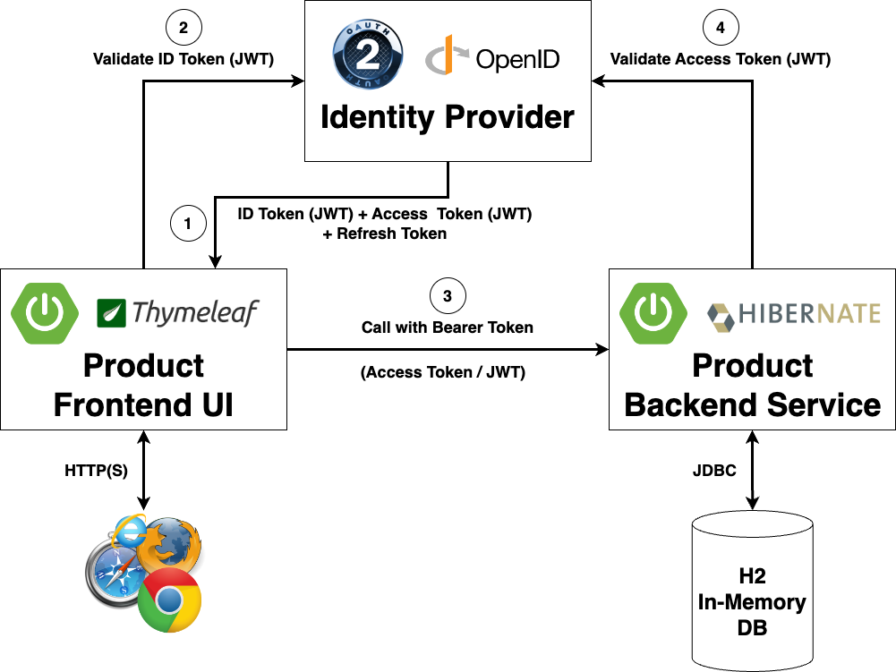

# Sample Application Architecture

## Project contents

After importing the project into your IDE you should see a project structure like in the following picture
(here the Eclipse project is shown, it may look different in other IDE's).

Basically you find 2 top level folders:

* workshop-initial: This will be the starting point to implement code as part of this workshop
    - product-initial: This is the provided sample product server microservice
    - ui-initial: This is the provided sample product ui client microservice
* workshop-solution: This is the reference solution for this workshop (please do NOT look into this now)
    - product-solution: This is the reference solution of a OAuth2/OIDC product server microservice
    - ui-solution: This is the reference solution of a OAuth2/OIDC product ui client microservice

## Architecture

We will extend the existing two microservices to use federated authentication based on OAuth 2.0 and OpenID Connect (OIDC).

* __Identity Provider__: This is central identity provider for single sign on which holds all users with their credentials
* __OAuth2/OIDC Resource Server (product-initial)__: The backend microservice providing product data (the OAuth2/OIDC resource server)
* __OAuth2/OIDC Client (ui-initial)__: The frontend UI microservice consuming the products (the OAuth2/OIDC client)

## Configuration

These microservices are configured to be reachable via the following URL addresses (Port 8080 is the default port in spring boot).

Service URLs:

| Service                    | URL                            |
|----------------------------|--------------------------------|
| Identity Provider          | https://access-me.eu.auth0.com |
| Client (UI)                | http://localhost:9095/client   |
| Resource Server (Products) | http://localhost:9090/server   |

__Note:__  
You can find more information on building OAuth 2.0/OIDC secured microservices with spring in
[Spring Boot Reference Documentation](https://docs.spring.io/spring-boot/docs/current/reference/htmlsingle/#boot-features-security-oauth2)
and in [Spring Security Reference Documentation](https://docs.spring.io/spring-security/site/docs/current/reference/htmlsingle/#oauth2)

So let's start with implementing the server side: The resource server.
