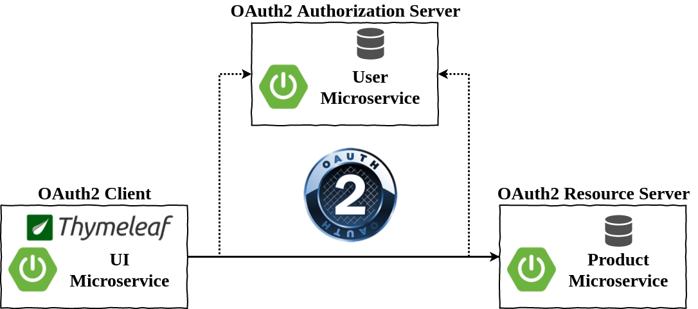

= Excercise for OAuth2
Andreas Falk <andreas.falk@novatec-gmbh.de>
:doctype: book
:icons: font
:source-highlighter: highlightjs
:toc: left
:toclevels: 3
:sectlinks:
:numbered: ''
:docinfo:

== What we will build

.We will extend the existing two microservices to use single sign authentication based on OAuth2.

* OAuth2 Authorization Server: This is the new microservice for single sign on which holds all users with their credentials
* OAuth2 Resource Server (Product Backend): The microservice providing product data maps to a resource server
* OAuth2 Client (UI Microservice): The thymeleaf UI microservice consuming the products maps to an OAuth2 client

.Microservice URL Adresses
|===
|Microservice |URL
|Authorization Server
|http://localhost:9999/users
|Client (UI)
|http://localhost:8081
|Resource Server (Products)
|http://localhost:8080
|===

== Basic OAuth2 Components

[[authorization-server]]
=== Authorization Server

TIP: You may look into the spring boot reference documentation http://docs.spring.io/spring-boot/docs/current/reference/htmlsingle/#boot-features-security-oauth2-authorization-server[Spring Boot Reference Documentation]
on how to implement an authorization server.

IMPORTANT: To prevent conflicts with different JSESSION cookies the authorization server must run
on a separate context path (not '/'). In our example please use '/users' as context path. In spring boot
this can be achieved by the _server.context_ property

To ensure OAuth2 authorization code grant works correctly with the other components the end points
of the authorization server must be as follows:

.Authorization Server Endpoints
|===
|Endpoint |Description |Caller
|/oauth/authorize
|Authorization endpoint (for login and client authorization)
|Client
|/oauth/token
|Token endpoint (exchanges given authorization code for access token)
|Client
|/oauth/check_token
|Check token endpoint (returns internal contents for access token)
|Resource Server
|===

[[authorization-server-maven-dependencies]]
==== Maven dependencies

include::{snippets}/authserver-mavenpom.adoc[]

<1> Dependency for base security filters (e.g. basic authentication)
<2> Dependency for OAuth2 support

==== Java Implementation

include::{snippets}/authserver-java.adoc[]

<1> Annotation to enable auto configuration of an Authorization Server

[[authorization-server-configuration]]
==== Configuration

include::{snippets}/authserver-props.adoc[]

[[resource-server]]
=== Resource Server (Products)

[[resource-server-maven-dependencies]]
==== Maven dependencies

include::{snippets}/mavenpom.adoc[]

==== Java Implementation

include::{snippets}/resourceserver-java.adoc[]

[[client]]
=== OAuth2 Client (Thymeleaf UI)

[[client-maven-dependencies]]
==== Maven dependencies

include::{snippets}/mavenpom.adoc[]

==== Java Implementation

include::{snippets}/client-java.adoc[]

== Advanced Level

.To make the sample application even more secure we will enhance the authorization server to...
- ...use a persistent store for users
- ...encrypt the passwords
- ...enable login using a form login page

=== Use persistent store

=== Encrypt the passwords

=== Provide form based login

