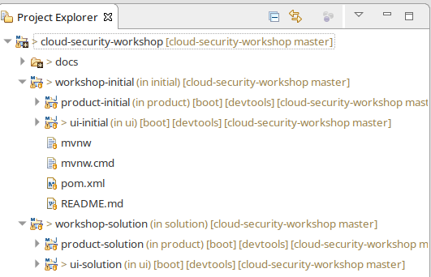
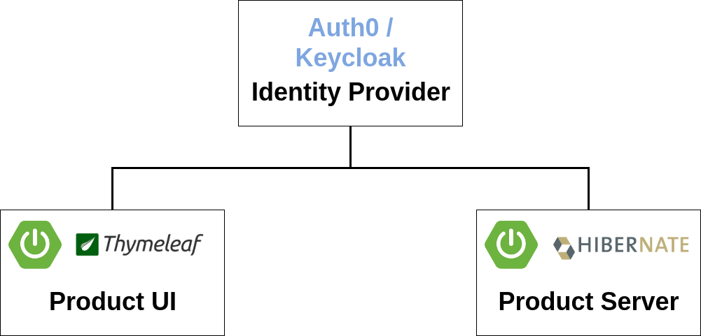

= Exercise for OAuth2 security
Andreas Falk <andreas.falk@novatec-gmbh.de>
:doctype: book
:icons: font
:source-highlighter: highlightjs
:toc: left
:toclevels: 3
:sectlinks:
:numbered: ''
:docinfo:

== Setup

=== System Requirements

To successfully complete this exercise you need the following:

* JDK 8, 11 or 13
* A Java IDE like Eclipse, IntelliJ or Visual Studio Code

=== Setup the project

1. Clone the git repository https://github.com/andifalk/cloud-security-workshop or download it as zip file
2. Import the whole directory into your Java IDE as Maven project
  * IntelliJ: File/New/Project from existing sources -> Select directory -> Select Maven in next step
  * Eclipse: File/Import -> Select 'Maven'/'Existing Maven Projects' -> Select directory -> Click 'Finish'
  * Visual Studio Code: Just open the directory with VS Code -> VS Code should automatically configure the project
3. Update Maven configuration to load dependencies (depending on your IDE)

=== Project contents

After importing the project into your IDE you should see a project structure like in the following picture
(here the Eclipse project is shown).

Basically you find 2 top level folders:

* workshop-initial: This will be the starting point to implement code as part of this workshop
    - product-initial: This is the provided sample product server microservice
    - ui-initial: This is the provided sample product ui client microservice
* workshop-solution: This is the reference solution for this workshop (please do NOT look into this now)
    - product-solution: This is the reference solution of a OAuth2/OIDC product server microservice
    - ui-solution: This is the reference solution of a OAuth2/OIDC product ui client microservice

== What we will build

.We will extend the existing two microservices to use single sign authentication based on OAuth 2.0 and OpenID Connect (OIDC).

* Auth0 Identity Provider: This is central identity provider for single sign on which holds all users with their credentials
* OAuth2/OIDC Resource Server (product-initial): The microservice providing product data maps to a resource server
* OAuth2/OIDC Client (ui-initial): The thymeleaf UI microservice consuming the products maps to an OAuth2/OIDC client

These microservices have to be configured to be reachable via the following URL addresses (Port 8080 is the default port in spring boot).

.Service URL Adresses
|===
|Service |URL
|Identity Provider
|https://access-me.eu.auth0.com
|Client (UI)
|http://localhost:9095/client
|Resource Server (Products)
|http://localhost:9090/server
|===

TIP: You can find more information on building OAuth2 secured microservices with spring in
https://docs.spring.io/spring-boot/docs/1.5.x/reference/htmlsingle/#boot-features-security-oauth2[Spring Boot Reference Documentation]
and in https://projects.spring.io/spring-security-oauth/docs/oauth2.html[Spring Security OAuth2 Developers Guide]

== Tutorial

So let's start with implementing the server side: The resource server.

[[resource-server]]
=== Resource Server (Products)

TIP: You may look into the spring boot reference documentation https://docs.spring.io/spring-boot/docs/1.5.x/reference/htmlsingle/#boot-features-security-oauth2-resource-server[Spring Boot Reference Documentation]
on how to implement a resource server.

[[resource-server-maven-dependencies]]
==== Maven dependencies

Add the following required dependencies to the existing maven pom file.

include::{snippets}/resourceserver-mavenpom.adoc[]

==== Java Implementation

The existing products service now should act as an OAuth2 resource server.
Therefore it has to be marked as such.

include::{snippets}/resourceserver-java.adoc[]

[[resource-server-configuration]]
==== Configuration

The following additional properties are required to make the resource server work with our new
authorization server.

include::{snippets}/resourceserver-props.adoc[]

[[client]]
=== OAuth2 Client (Thymeleaf UI)

TIP: You may look into the spring boot reference documentation https://docs.spring.io/spring-boot/docs/1.5.x/reference/htmlsingle/#boot-features-security-oauth2-single-sign-on[Spring Boot Reference Documentation]
on how to implement an OAuth2 single-sign-on client.

[[client-maven-dependencies]]
==== Maven dependencies

Add the following required dependencies to the existing maven pom file.

include::{snippets}/client-mavenpom.adoc[]

[[client-java-implementation]]
==== Java Implementation

The UI client now acts as OAuth2 client and must be marked as such.
Additionally to automatically use the OAuth2 tokens with all calls to REST services
the currently used _RestTemplate_ has to be replaced with new _OAuth2RestTemplate_

NOTE: In more advanced cloud scenarios you may also
use http://cloud.spring.io/spring-cloud-static/Dalston.RELEASE/#spring-cloud-feign[Feign Client]
instead of _OAuth2RestTemplate_ to call the REST Api. In that case you have to add an interceptor
for OAuth2.

include::{snippets}/client-java.adoc[]

include::{snippets}/client-service-java.adoc[]

[[client-configuration]]
==== Configuration

The following additional properties are required to make the UI client work with our new
authorization server.

include::{snippets}/client-props.adoc[]

