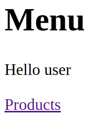
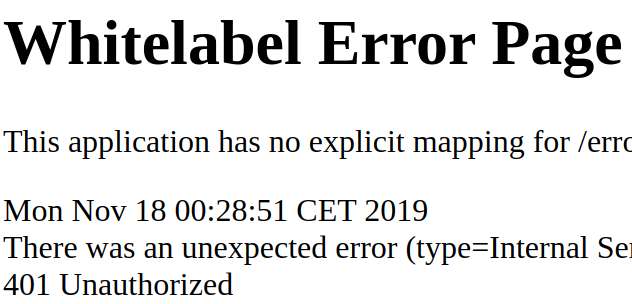
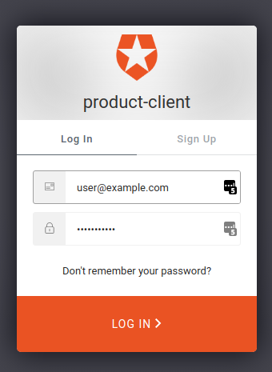
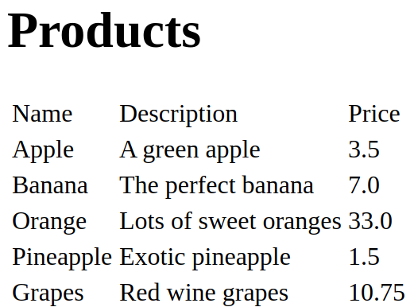

# Product Client Frontend UI

Now we will implement the corresponding client for the productEntity server to show the productEntity list in a web UI.

__Tip__:  
You may look into the [Spring Boot Reference Documentation](https://docs.spring.io/spring-boot/docs/current/reference/htmlsingle/#boot-features-security-oauth2-client)
 and the [Spring Security Reference Documentation](https://docs.spring.io/spring-security/site/docs/current/reference/htmlsingle/#oauth2client) on how to implement a client.

To start with this tutorial part, navigate to the project __initial/ui__ in your IDE.

First just run this unfinished client. Please make sure that you also have started the productEntity server from previous 
part.

Just run class _com.example.UiApplication_. Then navigate your web browser to http://localhost:9095/client.
You should see the following screen.



Now try to click the link for _Products_. This should lead to the following whitelabel error screen:



This is because our initial client still only sends a basic authentication header to authenticate the request for getting the
productEntity list. But the productEntity server now requires a JWT token instead. This is why we now get a 401 http status error (unauthorized).

So let's start with fixing this issue by implementing an OAuth2/OIDC client. 

## Step 1: Change Maven dependencies for the client

Add the following dependency to the existing maven _pom.xml_ file:

<u>_pom.xml_:</u>
```xml
<dependency>
    <groupId>org.springframework.boot</groupId>
    <artifactId>spring-boot-starter-oauth2-client</artifactId>
</dependency>
```

This adds the spring boot starter dependency for building an OAuth2/OIDC client.
This includes all required classes to manage the authorization code flow of OAuth2 and 
handle all JWT token related tasks.

## Step 2: Add required properties for the client

The client requires several configuration parameters from the identity server to be used.
Thanks to the OpenID Connect discovery specification most identity servers publish all required 
parameters at a well known server endpoint _/.well-known/openid-configuration_.
In case of _Auth0_ the url is https://access-me.eu.auth0.com/.well-known/openid-configuration.

This is why one parameter of spring (see below) is requiring the _issuer-uri_. This points to the
base url address of the identity server (i.e. without the _/.well-known/openid-configuration_ part).

Spring security provides predefined properties to configure the application as an OAuth2/OIDC client:

* The property ```spring.security.oauth2.client.provider.auth0.issuer-uri``` specifies 
the URI for loading the required configuration to setup an OAuth2/OIDC client for the _Auth0_ 
identity provider.
* The property ```spring.security.oauth2.client.provider.user-name-attribute``` specifies
  the attribute claim to use for mapping user data retrieved from user info endpoint in OAuth2/OIDC client for the _Auth0_
  identity provider.
* The property ```spring.security.oauth2.client.registration.auth0.client-id``` specifies 
the _client id_ as it is has been registered at the _Auth0_ identity provider.
* The property ```spring.security.oauth2.client.registration.auth0.clientAuthenticationMethod``` specifies 
the authentication method to use when calling the token endpoint at the _Auth0_ identity provider. The value of _NONE_ specifies that no _client_secret_ is specified, instead the dynamic _Proof Key for Key Exchange (PKCE)_ is used instead. 
* The property ```spring.security.oauth2.client.registration.auth0.authorizationGrantType``` specifies 
which OAuth2/OIDC grant flow should be used for the client.
* The property ```spring.security.oauth2.client.registration.auth0.redirect-uri``` specifies 
the redirect URI to call our client application with the authorization code 
from the _Auth0_ identity provider. Spring also provides predefined placeholders for the base url and the registration id.
* The property ```spring.security.oauth2.client.registration.auth0.scope``` specifies
  the scopes to be used for the OAuth2 login. The value of _openid_ enables the OpenID Connect mode and _profile_/_email_ specifies which attribute claims to include in the token.

After adding the required new properties the updated _application.yml_ should look like this:

<u>_application.yml_:</u>
```yaml
spring:
  security:
    oauth2:
      client:
        provider:
          auth0:
            issuer-uri: https://access-me.eu.auth0.com/
            user-name-attribute: sub
        registration:
          auth0:
            client-id: 'v13BSQLEZnw4N96V36dDdsGRd022isKe'
            authorizationGrantType: authorization_code
            clientAuthenticationMethod: NONE
            redirect-uri: '{baseUrl}/login/oauth2/code/{registrationId}'
            scope:
              - openid
              - profile
              - email
```

__Important:__  
Please check that all indents are correct. Otherwise, you may get strange runtime errors when starting
the application.
The client secret is noted here just for the purpose of this tutorial. In your real productive applications 
you should __NEVER__ publish sensitive data like this client secret or any other sensitive data!!

## Step 3: Add OAuth2/OIDC client security configuration 

To enable the client application to act as a OAuth2/OIDC client for _Auth0_ identity provider
it is required to add a new security configuration.

To achieve this, create a new class named _WebSecurityConfiguration_ in package _com.example_. 

<u>_com/example/WebSecurityConfiguration.java_:</u>

```java
package com.example;

import org.springframework.context.annotation.Bean;
import org.springframework.context.annotation.Configuration;
import org.springframework.security.config.annotation.web.builders.HttpSecurity;
import org.springframework.security.config.annotation.web.configuration.EnableWebSecurity;
import org.springframework.security.web.SecurityFilterChain;
import static org.springframework.security.config.Customizer.withDefaults;

@EnableWebSecurity
@Configuration
public class WebSecurityConfiguration {

  @Bean
  public SecurityFilterChain api(HttpSecurity http) throws Exception {
    http
            .authorizeHttpRequests(authorizeRequests ->
                    authorizeRequests
                            .anyRequest().authenticated()
            )
            .oauth2Client().and()
            .oauth2Login(withDefaults());
    return http.build();
  }
}
```

## Step 4: Update the call to the resource server

We already extended the productEntity server requiring a bearer token in the _Authorization_ header with each request.
To be able to call the server from the client we need to add the access token.

To achieve this we have to change the class _ProductService_ to add the required header with the token.

<u>_com/example/ProductService.java_:</u>

```java
package com.example;

import org.springframework.http.HttpEntity;
import org.springframework.http.HttpHeaders;
import org.springframework.http.HttpMethod;
import org.springframework.http.ResponseEntity;
import org.springframework.security.oauth2.core.OAuth2AccessToken;
import org.springframework.stereotype.Service;
import org.springframework.web.client.RestTemplate;

import java.util.Arrays;
import java.util.Collection;
import java.util.Collections;

@Service
public class ProductService {

  public Collection<Product> getAllProducts(OAuth2AccessToken oAuth2AccessToken) {

    RestTemplate template = new RestTemplate();

    ResponseEntity<Product[]> response =
            template.exchange(
                    "http://localhost:9090/server/products",
                    HttpMethod.GET,
                    new HttpEntity<Product[]>(createAuthorizationHeader(oAuth2AccessToken)),
                    Product[].class);

    if (response.getBody() != null) {
      return Arrays.asList(response.getBody());
    } else {
      return Collections.emptyList();
    }
  }

  private HttpHeaders createAuthorizationHeader(OAuth2AccessToken oAuth2AccessToken) {
    return new HttpHeaders() {
      {
        String authHeader = "Bearer " + oAuth2AccessToken.getTokenValue();
        set("Authorization", authHeader);
      }
    };
  }
}
```

In the _ProductController_ class we need to add  a reference to an instance of class _OAuth2AuthorizedClientService_.
By using this instance we can retrieve the required access token.

In addition to this we also show the currently authenticated user by adding a new parameter of 
type _org.springframework.security.oauth2.core.oidc.user.OidcUser_ annotated by _@AuthenticationPrincipal_.

<u>_com/example/ProductController_:</u>

```java
package com.example;

import org.springframework.beans.factory.annotation.Autowired;
import org.springframework.security.core.Authentication;
import org.springframework.security.core.annotation.AuthenticationPrincipal;
import org.springframework.security.oauth2.client.OAuth2AuthorizedClient;
import org.springframework.security.oauth2.client.OAuth2AuthorizedClientService;
import org.springframework.security.oauth2.core.oidc.user.OidcUser;
import org.springframework.stereotype.Controller;
import org.springframework.ui.Model;
import org.springframework.web.bind.annotation.GetMapping;

/** UI controller for products frontend. */
@Controller
public class ProductController {

  private final ProductService productService;
  private final OAuth2AuthorizedClientService authorizedClientService;

  @Autowired
  public ProductController(ProductService productService, OAuth2AuthorizedClientService authorizedClientService) {
    this.productService = productService;
    this.authorizedClientService = authorizedClientService;
  }

  @GetMapping(path = "/")
  public String index(@AuthenticationPrincipal OidcUser oidcUserInfo, Model model) {
    String fullName = oidcUserInfo.getUserInfo().getNickName();
    model.addAttribute("username", fullName);
    return "index";
  }

  @GetMapping(path = "/products")
  public String getAllProducts(Authentication authentication, Model model) {
    OAuth2AuthorizedClient authorizedClient =
            this.authorizedClientService.loadAuthorizedClient("auth0", authentication.getName());
    Iterable<Product> products = productService.getAllProducts(authorizedClient.getAccessToken());
    model.addAttribute("products", products);
    return "products";
  }
}
```

Please note that _"auth0"_ refers to the corresponding id of the client configuration in _application.yml_.

## Step 5: Run the client application

Now we can run the finished client as well. Please make sure that you also have started the productEntity server from previous 
part.

Just run class _com.example.UiApplication_. Then navigate your web browser to http://localhost:9095/client.

If you have successfully followed and completed all steps you should be redirected to the login dialog of the
identity server of _Auth0_.



To login please use the following user credentials:

* user: user@example.com
* password: user_4demo!

__Important:__  
The user credentials are noted here just for the purpose of this tutorial. In your real productive applications 
you should __NEVER__ publish user credentials or any other sensitive data!!

After successful login you should again be redirected back to the client application, and you should see
the main screen.


After clicking the _Products_ link you should see the list of products.



This ends the whole tutorial.

## License

Apache 2.0 licensed
Copyright (c) by 2023 Andreas Falk

[1]:http://www.apache.org/licenses/LICENSE-2.0.txt
