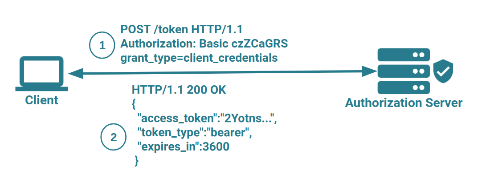
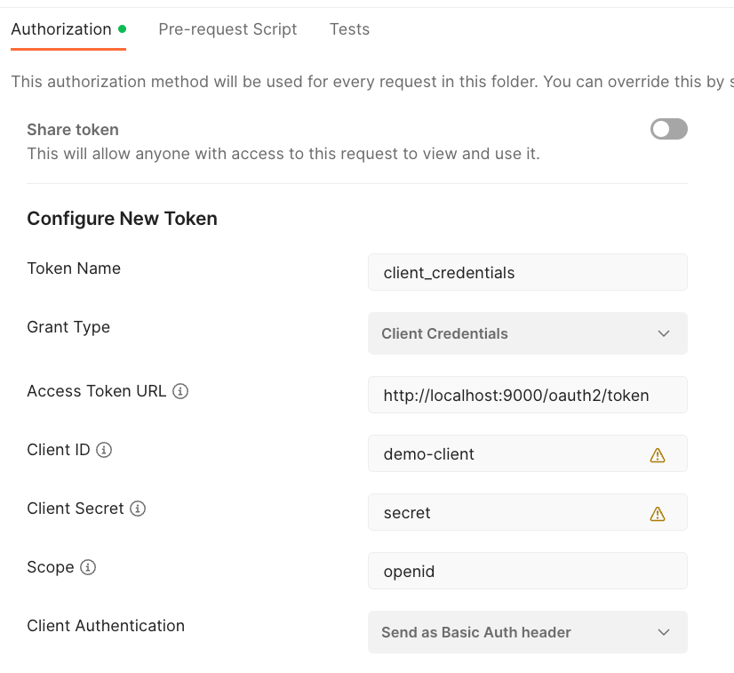
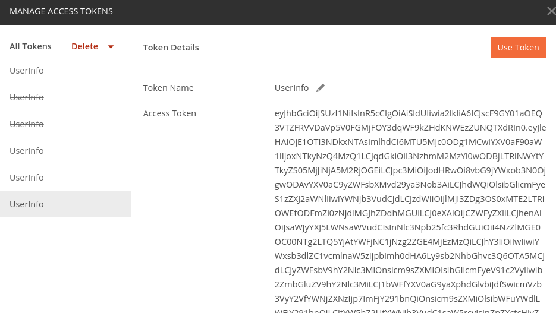
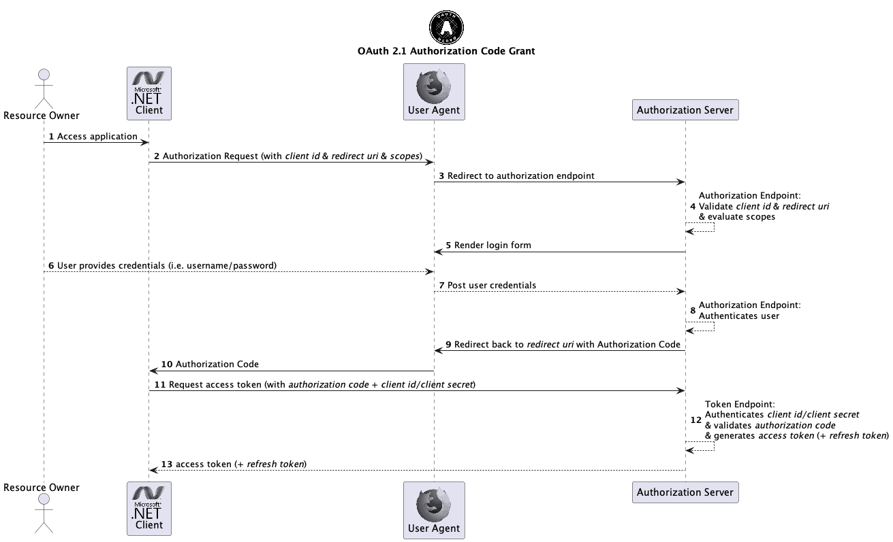
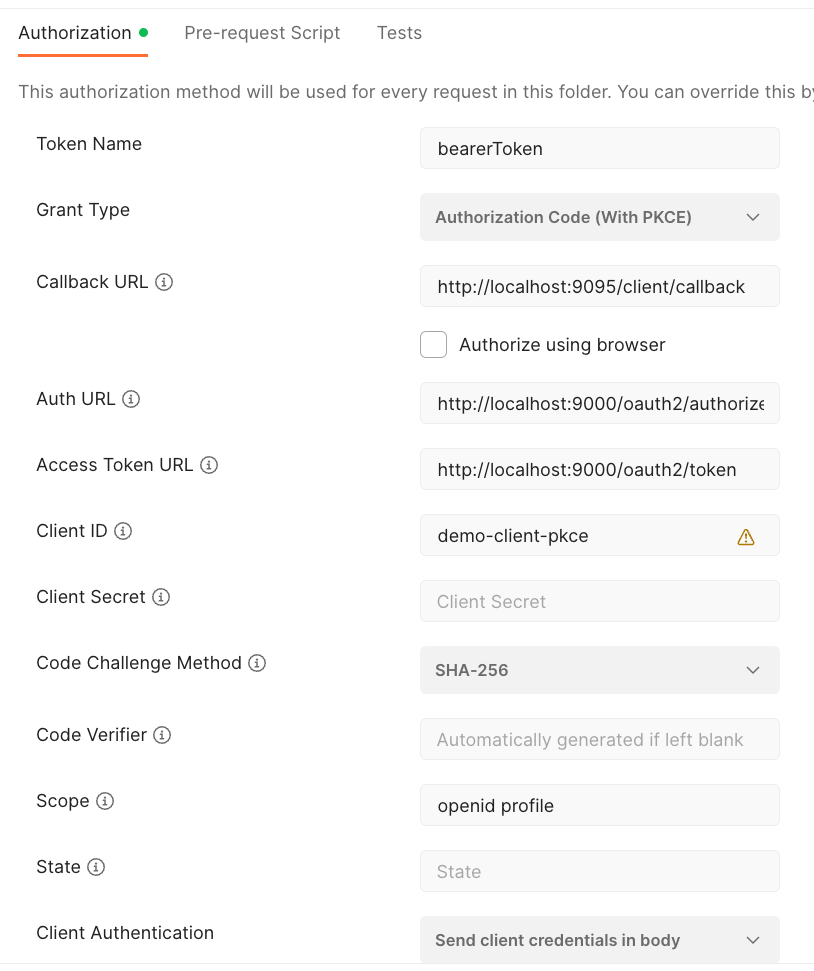
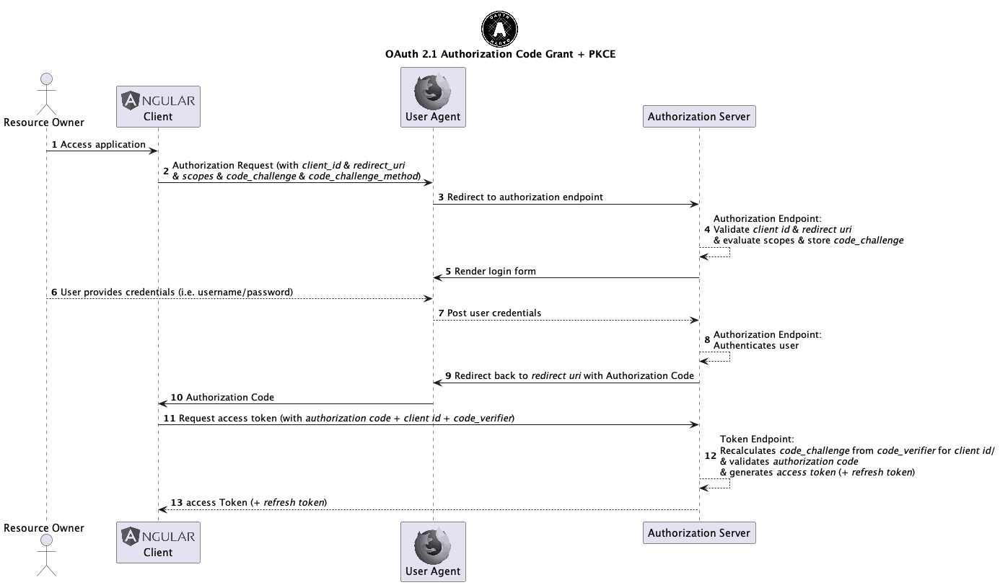

# Practice Authorization Grant Flows

This is the getting started lab for testing the simple OAuth 2.0 grants of [OAuth 2.0 Authorization](https://www.rfc-editor.org/rfc/rfc6749.html):

* Client Credentials
* Authorization Code
* Authorization Code with PKCE

As part of this we can also achieve the following targets:

1. Make sure the custom Spring Authorization Server is project is cloned and working as expected (see [setup](../../setup))
2. Get to know the tools to execute Http requests

* Curl
* Httpie
* Postman

## Run Authorization Server

Make sure you have set up all projects as described in the [Setup](../../setup) section.

## Client Credentials Grant

The first grant type we will evaluate here is the [OAuth 2.0 Client Credentials Grant](https://www.rfc-editor.org/rfc/rfc6749.html#section-4.4).



The required parameters for the client credentials grant are shown here:

| Parameter      | Value                              |
|----------------|------------------------------------|
| token url      | http://localhost:9000/oauth2/token |
| grant\_type    | client\_credentials                |
| client\_id     | demo-client                        |
| client\_secret | secret                             |
| scope          | openid                             |

### Curl

To retrieve an access token using _curl_ use the following command in a terminal:

```shell
curl -X POST -H "Content-Type: application/x-www-form-urlencoded" -d "grant_type=client_credentials&client_id=demo-client&client_secret=secret" http://localhost:9000/oauth2/token
```

This should return a response similar to this one:

```json
{
  "access_token":"eyJhbGciOiJSUzI1NiIsI...",
  "expires_in":300,
  "refresh_expires_in":1800,
  "refresh_token":"eyJhbGciOiJIUzI1N...",
  "token_type":"bearer",
  "scope":"openid ..."
}
```

### Httpie

To retrieve an access token using _httpie_ use the following command in a terminal:

```shell
http --form POST http://localhost:9000/oauth2/token grant_type='client_credentials' client_id='demo-client' client_secret='secret'
```

This should return a response similar to the one for curl.

### Postman

To get an access token via the client credentials grant using postman just create a new request (the request url is not important). Then switch to the _Authorization_ tab and select _OAuth 2.0_ in the _Type_ drop down box and fill the request details.



Now click on the button _Get New Access Token_, this will open the following dialog.



## Authorization Code Grant

The [authorization code grant](https://www.rfc-editor.org/rfc/rfc6749.html#section-4.1) is the flow mostly used in today's applications adopting OAuth 2.0.

1. The flow starts with the authorization request, this redirects to the authorization server. Here the user logs in using his credentials and approves a consent page
2. After successfully logging in a 302 HTTP redirect request with the authorization code is being sent through to the browser which redirects to the callback entry point provided by the client application
3. Now the client application sends a token request to the authorization server to exchange the authorization code into an access token



This grant cannot be performed in _curl_ or _httpie_ because of the interactive process of this grant flow requiring the user to manually log in using a web form.

The required parameters for the authorization code grant are shown here:

| Parameter         | Value                                  |
| ----------------- | -------------------------------------- |
| authorization url | http://localhost:9000/oauth2/authorize |
| token url         | http://localhost:9000/oauth2/token     |
| grant\_type       | code                                   |
| client\_id        | demo-client                            |
| client\_secret    | secret                                 |
| scope             | openid                                 |
| redirect\_uri     | http://127.0.0.1:9095/callback         |

### Postman

To get an access token via the authorization code grant using postman just create a new request (the request url is not important). Then switch to the _Authorization_ tab and select _OAuth 2.0_ in the _Type_ drop down box.



Here, select _Authorization Code_ in the _Grant Type_ drop down box, then fill in the details of the Postman view shown using the required data from the table above and click _Request Token_. You may also switch on _Authorize using browser_ check box, then Postman uses your web browser for the redirects instead of its own window.

Then you should see the response in Postman:


According to the [OAuth2 specification](https://tools.ietf.org/html/rfc6749#section-4.1.2):

> The authorization code MUST expire shortly after it is issued to mitigate the risk of leaks. A maximum authorization code lifetime of 10 minutes is RECOMMENDED. The client MUST NOT use the authorization code more than once.

Spring Authorization Server uses a really short authorization code lifetime of 5 minutes by default. So you only have 5 minutes to grab the authorization code from the web browser and use it to exchange it into a token!

## Authorization Code + Proof Key for Code Exchange (PKCE)

The required parameters for the authorization code grant + PKCE are shown here:

| Parameter         | Value                                  |
| ----------------- | -------------------------------------- |
| authorization url | http://localhost:9000/oauth2/authorize |
| token url         | http://localhost:9000/oauth2/token     |
| grant\_type       | code                                   |
| client\_id        | demo-client-pkce                       |
| scope             | openid                                 |
| redirect\_uri     | http://127.0.0.1:9095/callback         |

You might notice that the client\_secret is not required any more. This is because with the addition of PKCE the static credentials of client\_secret is replaced by dynamically generated and calculated credentials (the code verifier and code challenge).



### Postman

To use this slightly changed and improved (security wise) grant flow in postman just select _Authorization Code (with PKCE)_ in the _Grant Type_ drop down box, replace the client\_id with the one above and remove the client\_secret value.


In the next labs we won't have to create all the requests on our own, instead we will let Spring Security do the work for us.
