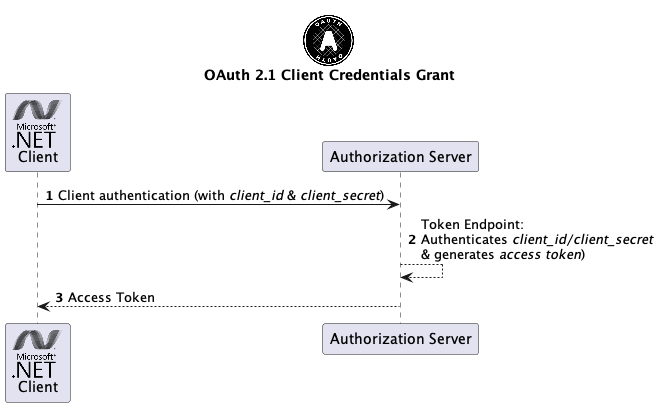

# Introduction into OAuth 2.0/2.1 (OAuth2) and OpenID Connect (OIDC)

This workshop introduces two of the most important federated identity methods and standards 
used in current software architectures:

* OAuth 2.0 with latest additions of OAuth 2.1 draft specifications
* OpenID Connect 1.0 (OIDC)

First, introduction tells more about digital identities and Identity and Access Management (IAM) systems in general.
Further sections will go deeper into details of OAuth 2.0/2.1, OpenID Connect 1.0 and authentication tokens.

## Digital Identities

The book [learning digital identities](https://www.oreilly.com/library/view/learning-digital-identity/9781098117689/) is correct when it states that _identity is bigger than you think_.
It is not just about a username and a password.
Identities are very old and well-known from the physical world like birth certificates or passports.

A digital identity contains data that uniquely describes a person or thing but also contains information
about the subject’s relationships to other entities.  
In the context of digital identities you have to deal with different areas like:

* Privacy
* Trust
* Authenticity 
* Confidentiality 
* Federation
* Identity architectures and ecosystems

Today, most companies buy their identity systems. Identity and access management (IAM) is now a very big industry.
The diagram below shows the configuration and operation phases of IAM and additionally the difference between the 
identity and access management parts.

(Source: Wikipedia)

Identity management (IdM) is the task of controlling information about users on computers. Access control is the enforcement of access rights defined as part of access authorization.

### Identity Architectures

The architecture of identity systems can be classified by its degree of autonomy for the participants.
The vast majority of identity systems are implemented for the purpose of organizations and follow the administrative identity architecture type. The whole ruleset of operation, assigning identities, defining attributes, and sharing is determined by the organization.  

In the context of the internet users are required to have lots of different accounts. That is why user-centered identity systems have been established. By using protocols like OAuth 2.0 and OpenID Connect with social login (login with Facebook, Twitter, GitHub etc.) users are given a higher degree of autonomy. 

Modern self-sovereign identity systems give full control to participants in terms of certifiable identifiers, choice on sharing attributes and relationships.

(Source: Learning Digital Identity)

## Federated Identities

### OAuth 2.0/2.1 (OAuth2)

#### Authorization Grants

##### Client Credentials grant + PKCE

##### Authorization Code grant

##### Authorization Code grant + PKCE

#### Tokens

#### Scopes

### OpenID Connect (OIDC) 1.0

#### Authorization Grants

#### Tokens

