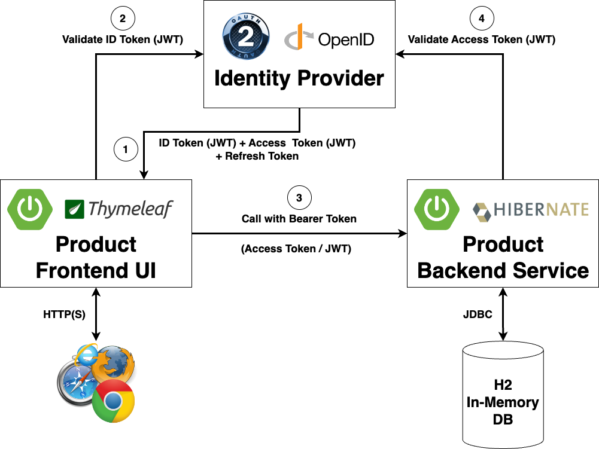
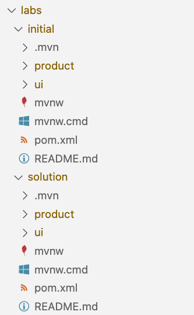

# Sample Application Architecture

## Architecture

We will extend the existing two microservices to use federated authentication based on OAuth 2.1 and OpenID Connect (OIDC).

* __OpenID Connect (OIDC) Identity Provider__: This is central identity provider for single sign on which holds all users with their credentials
* __OAuth2/OIDC Resource Server (product-initial)__: The backend microservice providing product data (the OAuth2/OIDC resource server)
* __OAuth2/OIDC Client (ui-initial)__: The frontend UI microservice consuming the products (the OAuth2/OIDC client)

## Configuration

These microservices are configured to be reachable via the following URL addresses (Port 8080 is the default port in spring boot).

Service URLs:

| Service                        | URL                                                          |
|--------------------------------|--------------------------------------------------------------|
| OIDC Identity Provider         | [http://localhost:9000](http://localhost:9000)               |
| Client (UI)                    | [http://localhost:9095/client](http://localhost:9095/client) |
| Resource Server (Products API) | [http://localhost:9090/server](http://localhost:9090/server) |

## Project contents

After importing the project into your IDE you should see a project structure like in the following picture. Here the VS Code project is shown, it may look different in other IDE's.

The main contents for this workshop consist of the following directories:

* __intro-labs__: 
In the sub-directory _auth-code-in-action_ you find a demo application that illustrates the OAuth 2 authorization code grant flow in details. Here you can follow all the subsequent steps happening during this protocol flow variant.  
In the sub-directory _oauth_grants_ you get instructions on how to try different OAuth 2 authorization grant flows yourself with different tools like _postman_, _curl_ and _httpie_.

* __labs__:
In this directory you find the workshop lab parts.
  * initial: This will be the starting point to implement code as part of this workshop
    - product: This is the provided sample product server microservice
    - ui: This is the provided sample product ui client microservice
  * solution: This is the reference solution for this workshop (please do NOT look into this now)
    - product: This is the reference solution of a OAuth2/OIDC product server microservice
    - ui: This is the reference solution of a OAuth2/OIDC product ui client microservice
 
> **Info:** You can find more information on building OAuth 2.0/OIDC secured microservices with spring in
[Spring Boot Reference Documentation](https://docs.spring.io/spring-boot/docs/current/reference/htmlsingle/#boot-features-security-oauth2)
and in [Spring Security Reference Documentation](https://docs.spring.io/spring-security/site/docs/current/reference/htmlsingle/#oauth2)

So let's start with implementing the server side: The API (resource server).
