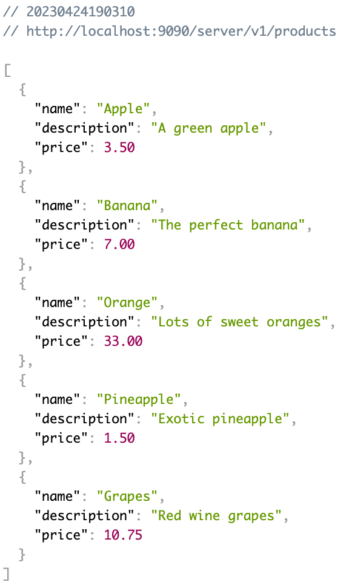
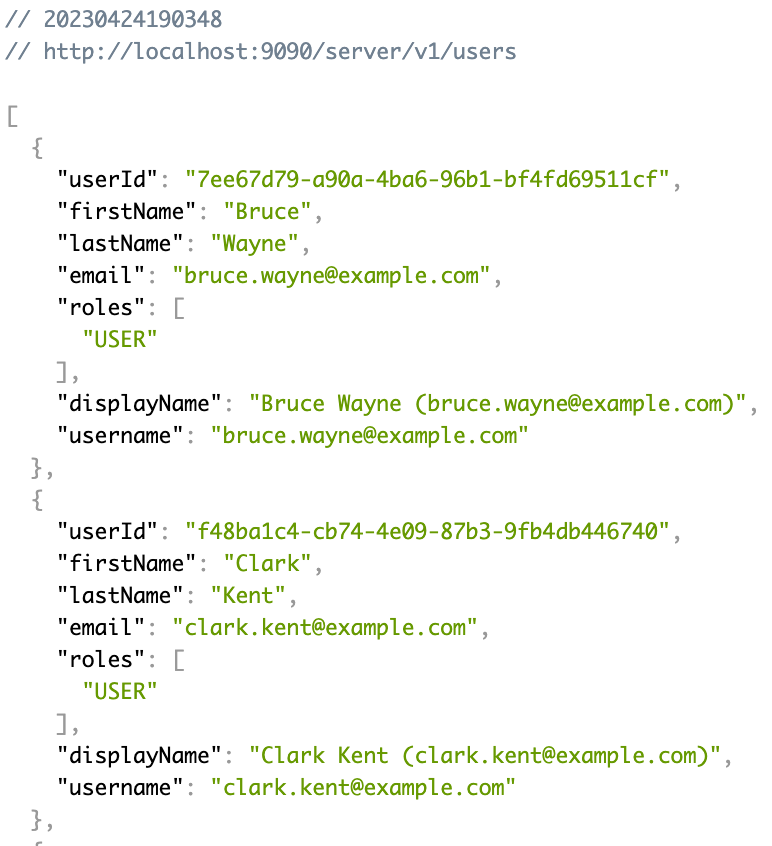
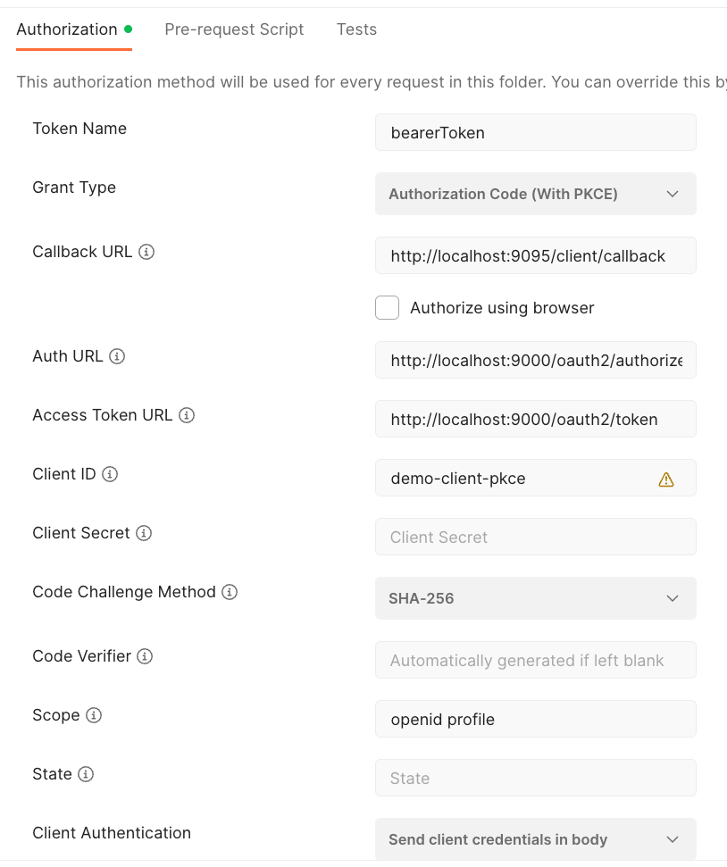

# Lab 1: The server side (resource server)

> __Tip__:  
> You may look into the [Spring Boot Reference Documentation](https://docs.spring.io/spring-boot/docs/current/reference/htmlsingle/#boot-features-security-oauth2-server)
> and the [Spring Security OAuth2 Resource Server Reference Documentation](https://docs.spring.io/spring-security/site/docs/current/reference/htmlsingle/#oauth2resourceserver) on how 
> to implement a resource server.

## Learning Targets

In this lab you will learn:

* Authentication using JSON Web Tokens (JWT) sent via HTTP header
* Validation of the JWT (Signature and expiry date/time) with loading public key for validating
* Authorize users by using the roles claim inside the access token

## Step 1: Explore the existing server application

To start with this tutorial please navigate to the project `labs/initial/product` in your IDE.  
This is the starting point for all following implementation steps.  
The existing product server is using the base spring security lib to secure its endpoints using basic authentication and form login.

Before diving into changing the server application into a resource server it is recommended to explore the existing application.
The application exposes several API endpoints. All endpoints are documented by OpenAPI 3.

To start the product server select the class _com.example.ProductApplication_ and run this in your IDE.

You can find the Swagger documentation at [http://localhost:9090/server/swagger-ui/index.html](http://localhost:9090/server/swagger-ui/index.html).
The corresponding OpenAPI JSON doc can be found at [http://localhost:9090/server/v3/api-docs](http://localhost:9090/server/v3/api-docs).

You may also directly access the API endpoints for retrieving protected resources:

If you call the [http://localhost:9090/server/v1/products (products endpoint)](http://localhost:9090/server/v1/products) then you will get the following result:



If you call the [users endpoint](http://localhost:9090/server/v1/users) then you will get these results:



Both endpoints are secured by basic authentication or form based login.
you can access the endpoints by using the following user credentials (access for users list requires `ADMIN` role):

| Username/Password               | Role(s)     |
|---------------------------------|-------------|
| bruce.wayne@example.com/wayne   | USER        |
| clark.kent@example.com/kent     | USER        |
| peter.parker@example.com/parker | ADMIN, USER |

To make accessing the APIs more convenient you can use the provided postman collection. Please check the _setup_ section for details.

Now let's start with changing the server into a resource server using modern authentication with a JSON web token (JWT).

## Step 2: Change Maven dependencies for resource server

To change these existing authentication mechanisms to JWT authentication as a resource server we need to adapt the 
spring security dependencies, i.e. use the corresponding one for building a secure OAuth2/OIDC resource server instead of simple
basic authentication.

To perform this required change replace the following dependency in the existing maven _pom.xml_ file:

<u>_pom.xml_:</u>
```xml
<dependency>
    <groupId>org.springframework.boot</groupId>
    <artifactId>spring-boot-starter-security</artifactId>
</dependency>
```

with this new dependency:

<u>_pom.xml_:</u>
```xml
<dependency>
    <groupId>org.springframework.boot</groupId>
    <artifactId>spring-boot-starter-oauth2-resource-server</artifactId>
</dependency>
```

## Step 3: Add required properties for resource server

The resource server requires the public key(s) to validate the signature of incoming JSON web tokens (JWT). This way nobody can
just issue their own JWT tokens or modify the issued token along the transmission path.
The public key(s) will be automatically grabbed from the JSON web key set provided by the
identity provider at http://localhost:9000/oauth2/jwks.

This endpoint publishes the public key(s) that are each identified by their key id (_kid_).

```json
{
  "keys": [
    {
      "kty": "RSA",
      "e": "AQAB",
      "kid": "857967b1-e57e-494f-92a7-1446439a244c",
      "n": "wiREnTOKYuPrIjoMF_OPKfhb-zKh4V3gAShjKNSIBRrRGhVZDmklQo9occMUiOK_2kywG-6Y_YyU6VVE8R951-QCZNLXQndWHO0pMx05_Va6G1b6TyfHiMZNoGcz5XSiK92bW0rJMHEwu6hbTrTiy-jw2lhQA1mIBYgvmIB_1SZOXEjzvvub6yJrNowYY57i1T2FQP_2E47pIartUNyROQZ-6A3hsy32BGG7xdAZ6WT-L4lr8YzpSiVPdTtmU493CqJ5mckkteln_j7qp8LkkDT49y86hrVo9nhOMUQG2krgrioPyR4tHk1t99tjPjP5cV_rSGAwYPMMboKu8Qj-3Q"
    }
  ]
}
```

Whenever the resource server gets a JSON Web Token (JWT) with a _kid_ in the header part (like the following sample), then Spring Security fetches the public key with the matching key id from this JWKS endpoint, caches it (so it does not have to load it for every request) and validates the JWt with the loaded public key.

JWT Header:

```json
{
  "kid": "857967b1-e57e-494f-92a7-1446439a244c",
  "alg": "RS256"
}
```

JWT Payload:

```json
{
  "sub": "c52bf7db-db55-4f89-ac53-82b40e8c57c2",
  "email_verified": true,
  "profile": "https://example.com/bwayne",
  "roles": [
    "USER"
  ],
  "iss": "http://localhost:9000",
  "preferred_username": "bwayne",
  "given_name": "Bruce",
  "aud": "demo-client",
  "nbf": 1683668207,
  "updated_at": "1970-01-01T00:00:00Z",
  "scope": [
    "profile",
    "offline_access"
  ],
  "name": "Bruce Wayne",
  "nickname": "bwayne",
  "exp": 1683668507,
  "iat": 1683668207,
  "family_name": "Wayne",
  "email": "bruce.wayne@example.com"
}
```

Spring security provides a predefined property `spring.security.oauth2.resourceserver.jwt.jwt-set-uri` to specify this JWKS endpoint for loading and caching public keys.

After adding this new property the updated _application.yml_ should look like this:

__Application.yml__:

```yaml
spring:
  jpa:
    open-in-view: false
  security:
    oauth2:
      resourceserver:
        jwt:
          jwk-set-uri: http://localhost:9000/oauth2/jwks
```

> __Important:__  
> Please check that all indents in the yaml file are correct. Otherwise, you may get strange runtime errors 
> when starting
> the application.

## Step 4: Change security configuration for resource server

Please navigate to the class `com.example.security.WebSecurityConfiguration` in your IDE
and change this with the following contents.

__com.example.security.WebSecurityConfiguration.java__:

```java
package com.example.security;

import org.springframework.context.annotation.Bean;
import org.springframework.context.annotation.Configuration;
import org.springframework.security.config.annotation.web.builders.HttpSecurity;
import org.springframework.security.config.annotation.web.configuration.EnableWebSecurity;
import org.springframework.security.web.SecurityFilterChain;

import static org.springframework.security.config.http.SessionCreationPolicy.STATELESS;

@EnableWebSecurity
@Configuration
public class WebSecurityConfiguration {

    @Order(1)
    @Bean
    public SecurityFilterChain docs(HttpSecurity http) throws Exception {
        http.securityMatcher("/v3/**", "/swagger-ui.html", "/swagger-ui/**", "/actuator/health", "/actuator/info")
                .httpBasic().disable().formLogin().disable()
                .authorizeHttpRequests().anyRequest().permitAll();
        return http.build();
    }
    
    @Bean
    public SecurityFilterChain api(HttpSecurity http) throws Exception {
      http.csrf()
              .disable()
              .sessionManagement()
              .sessionCreationPolicy(STATELESS)
              .and()
              .httpBasic()
              .disable()
              .formLogin()
              .disable()
              .authorizeHttpRequests()
              .anyRequest()
              .authenticated()
              .and()
              .oauth2ResourceServer()
              .jwt();
      return http.build();
  }
}
```

In this updated security configuration (the second SecurityFilterChain called api(...)) we:

* disable web sessions as with token authentication each request must contain the token in the header and a session cookie is not required any more (stateless authentication)
* disable [CSRF]() protection as we do not use session cookies anymore and therefore are not vulnerable for CSRF attacks
* disable basic authentication and formula based login (we only support token based authentication now)
* enable the application to act as an OAuth2/OIDC resource server requiring JWT as bearer tokens in the _authorization_ header

Please note that the bean definition for the `PasswordEncoder` has been removed as well as the password encoding
is not required any more.

This will cause compilation errors in `ProductInitializer` class. To solve these just remove all references 
to the encoder in that class. There is also no need anymore to create users as users are not required any more to log in. 
This will be achieved by the OAuth authorization server (only this component knows about user credentials and other user details). 

__com.example.ProductInitializer.java__:

```java
package com.example;

import com.example.product.ProductEntityEntity;
import com.example.product.ProductEntityRepository;
import org.slf4j.Logger;
import org.slf4j.LoggerFactory;
import org.springframework.boot.CommandLineRunner;
import org.springframework.stereotype.Component;

import java.util.Collections;
import java.util.stream.Stream;

/** Initializes some products in database. */
@Component
public class ProductInitializer implements CommandLineRunner {
 private static final Logger LOG = LoggerFactory.getLogger(ProductInitializer.class.getName());

 private final ProductEntityRepository productEntityRepository;
 
 public ProductInitializer(ProductEntityRepository productEntityRepository) {
  this.productEntityRepository = productEntityRepository;
 }

 @Override
 public void run(String... strings) {
  Stream.of(
                  new ProductEntity("Apple", "A green apple", 3.50),
                  new ProductEntity("Banana", "The perfect banana", 7.00),
                  new ProductEntity("Orange", "Lots of sweet oranges", 33.00),
                  new ProductEntity("Pineapple", "Exotic pineapple", 1.50),
                  new ProductEntity("Grapes", "Red wine grapes", 10.75))
          .forEach(productEntityRepository::save);

  LOG.info("Created " + productEntityRepository.count() + " products");
 }
}
```

## Step 5: Convert the JWT into the ProductUser object

With the changes of step 3 the base configuration for a resource server is set up.
But there is one issue with this change.
In class `com.example.product.ProductRestController` we do not get `ProductUser` as input for `@AuthenticationPrincipal`.   
Instead, by default the class `org.springframework.security.oauth2.jwt.Jwt` will be provided as input (as this is the standard authenticated principle object when JWT is used in spring security). 

```java  
@RestController
public class ProductRestController {
  //...
  @GetMapping(path = "/products")
  public List<Product> getAllProducts(@AuthenticationPrincipal(errorOnInvalidType = true) ProductUser productUser) {
    //...
  }
}
``` 

To change this behavior we have to add our own converter from the JWT token to the _ProductUser_ class.
This is done in several steps.

First we need to define our own type of the interface `AuthenticationToken`. This is the central point where Spring Security stores all authentication details after authentication has been successfully performed.

For convenience spring security provides the `AbstractAuthenticationToken` that implements most parts of `AuthenticationToken`.

__com.example.security.ProductUserAuthenticationToken__:

```java
package com.example.security;

import com.example.productuser.ProductUser;
import org.springframework.security.authentication.AbstractAuthenticationToken;
import org.springframework.security.core.GrantedAuthority;

import java.util.Collection;

public class ProductUserAuthenticationToken extends AbstractAuthenticationToken {

    private final ProductUser productUser;

    public ProductUserAuthenticationToken(ProductUser productUser, Collection<? extends GrantedAuthority> authorities) {
        super(authorities);
        setAuthenticated(true);
        this.productUser = productUser;
    }

    @Override
    public Object getCredentials() {
        return "n/a";
    }

    @Override
    public Object getPrincipal() {
        return this.productUser;
    }
}
```

The previous class will now be used as part of the _ProductJwtAuthenticationConverter_.
This converts contents of the JWT token into attributes of our _ProductUser_.

__com.example.security.ProductJwtAuthenticationConverter__:

```java
package com.example.security;

import com.example.productuser.ProductUser;
import com.example.productuser.ProductUserService;
import org.springframework.beans.factory.annotation.Autowired;
import org.springframework.core.convert.converter.Converter;
import org.springframework.security.authentication.AbstractAuthenticationToken;
import org.springframework.security.oauth2.jwt.Jwt;
import org.springframework.stereotype.Component;

import java.util.ArrayList;
import java.util.List;

@Component
public class ProductJwtAuthenticationConverter implements Converter<Jwt, AbstractAuthenticationToken> {

    private static final List<String> ROLE_CLAIMS = List.of("roles", "permissions");
    private static final String FIRST_NAME_CLAIM = "given_name";
    private static final String LAST_NAME_CLAIM = "family_name";
    private static final String EMAIL_CLAIM = "email";

    private final ProductUserService productUserService;

    @Autowired
    public ProductJwtAuthenticationConverter(ProductUserService productUserService) {
        this.productUserService = productUserService;
    }

    @Override
    public AbstractAuthenticationToken convert(Jwt jwt) {
        ProductUser productUser = new ProductUser(
                jwt.getSubject(), jwt.getClaimAsString(FIRST_NAME_CLAIM), jwt.getClaimAsString(LAST_NAME_CLAIM),
                "n/a", jwt.getClaimAsString(EMAIL_CLAIM), getRolesFromToken(jwt));
        // register the user, so we know what users are known to our system
        if (productUserService.findByUserId(productUser.getUserId()).isEmpty()) {
            productUserService.save(productUser);
        }
        return new ProductUserAuthenticationToken(productUser, productUser.getAuthorities());
    }

    private List<String> getRolesFromToken(Jwt jwt) {
        List<String> roles = new ArrayList<>();
        for (String claim : ROLE_CLAIMS) {
            if (jwt.hasClaim(claim)) {
                roles.addAll(jwt.getClaimAsStringList(claim));
            }
        }
        return roles.stream().map(String::toUpperCase).toList();
    }
}
```

> __Please note:__   
> The existing _ProductUserDetailsService_ class is not required any more and is replaced by the `ProductJwtAuthenticationConverter` above.  
> So this class can be deleted completely.

Finally, we have to add this new `ProductJwtAuthenticationConverter` to the security configuration.

__com.example.security.WebSecurityConfiguration.java__:

```java
package com.example.security;

import org.springframework.context.annotation.Bean;
import org.springframework.context.annotation.Configuration;
import org.springframework.core.annotation.Order;
import org.springframework.security.config.annotation.web.builders.HttpSecurity;
import org.springframework.security.config.annotation.web.configuration.EnableWebSecurity;
import org.springframework.security.web.SecurityFilterChain;

import static org.springframework.security.config.http.SessionCreationPolicy.STATELESS;

@EnableWebSecurity
@Configuration
public class WebSecurityConfiguration {

    private final ProductJwtAuthenticationConverter productJwtAuthenticationConverter;

    public WebSecurityConfiguration(ProductJwtAuthenticationConverter productJwtAuthenticationConverter) {
        this.productJwtAuthenticationConverter = productJwtAuthenticationConverter;
    }

    @Order(1)
    @Bean
    public SecurityFilterChain docs(HttpSecurity http) throws Exception {
        http.securityMatcher("/v3/**", "/swagger-ui.html", "/swagger-ui/**", "/actuator/health", "/actuator/info")
                .httpBasic().disable().formLogin().disable()
                .authorizeHttpRequests().anyRequest().permitAll();
        return http.build();
    }

    @Bean
    public SecurityFilterChain api(HttpSecurity http) throws Exception {
        http.csrf()
                .disable()
                .sessionManagement()
                .sessionCreationPolicy(STATELESS)
                .and()
                .httpBasic()
                .disable()
                .formLogin()
                .disable()
                .authorizeHttpRequests()
                .anyRequest()
                .authenticated()
                .and()
                .oauth2ResourceServer()
                .jwt().jwtAuthenticationConverter(productJwtAuthenticationConverter);
        return http.build();
    }
}
```

## Step 6: Run the product server application

Now we are ready to re-start the product server.
Select the class `com.example.ProductApplication` and run this (use the right mouse button in your IDE or the spring boot dashboard if applicable).

To test the REST Api [http://localhost:9090/server/products](http://localhost:9090/server/products) of the running product server we will use Postman. You may also use command line tools like _curl_ or _httpie_ as well.

If you have imported the postman collection as described in the _setup_ section then the authorization part should be pre-filled.



These are the required values that should be already configured in the _Authorization_ tab:

| Input              | Value                                  |
|--------------------|----------------------------------------|
| Grant Type         | Authorization Code with PKCE           |
| Authorization URL  | https://localhost:9000/oauth/authorize |
| Access Token URL   | https://localhost:9000/oauth/token     |
| Client ID          | demo-client-pkce                       |

All requests of the postman collection inside the folder _OAuth2 Bearer Token_ require a valid JWT. So if you perform such request you will get a 401 error because the JWT token is missing to access this endpoint.

To get such a token click on the folder _OAuth2 Bearer Token_, then navigate to the tab _Authorization_ click on the _Get New Access Token_ button.

After you got a token click _proceed_ and then click on _Use Token_try again to send the request.
This time it should work, and you should see a list of products as JSON response.

In the next step we will make accessing the backend service a bit more user-friendly by enabling a provided client frontend to retrieve products from the backend using OAuth2/OIDC access tokens. 
