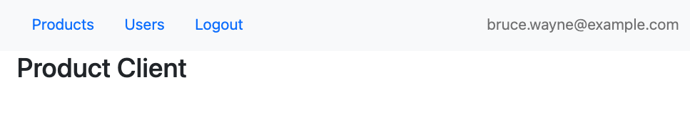
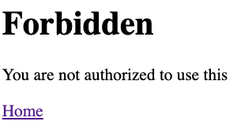
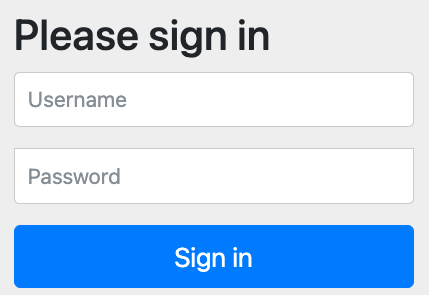
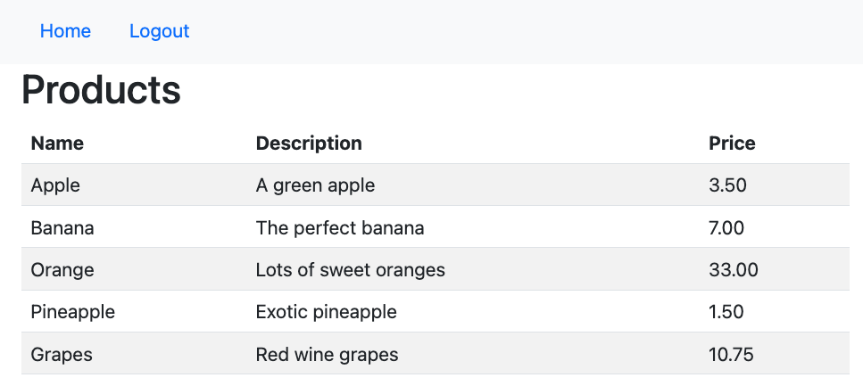
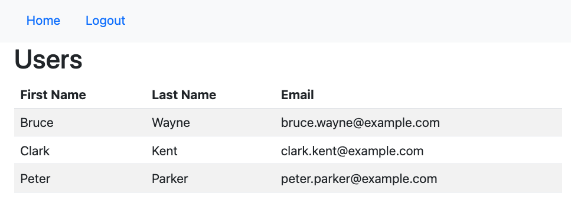

# Lab 2: The client side

Now we will implement the corresponding client for the product server to show the product list in a web UI.

> __Tip__:  
> You may look into the [Spring Boot OAuth2 Client Reference Documentation](https://docs.spring.io/spring-boot/docs/current/reference/htmlsingle/#boot-features-security-oauth2-client)
> and the [Spring Security OAuth2 Client Reference Documentation](https://docs.spring.io/spring-security/site/docs/current/reference/htmlsingle/#oauth2client) on how to implement a client.

## Learning Targets

In this lab you will learn:

* Trigger the OAuth2/OIDC authorization code grant + Proof Key for Code Exchange (PKCE) flow and get ID + access token from authorization server
* Validate and read information from ID token and user info endpoint
* Send access tokens (JWT) to resource server as bearer token via HTTP header

## Step 1: Explore the existing client application

To start with this tutorial part, navigate to the project `labs/initial/ui` in your IDE.

First just run this unfinished client. Please make sure that you also have started the product server from previous 
part.

Just run class `com.example.UiApplication` or use `mvnw spring-boot:run` in that project.
Then navigate your web browser to http://localhost:9095/client. You should see the following screen.



Now try to click the link for _Products_. This should lead to the following whitelabel error screen:



This is because our initial client still only sends a basic authentication header to authenticate the request for getting the
product list. But the product server now requires a JWT token instead. This is why we now get a 401 http status error (unauthorized).

So let's start fixing this issue by implementing a full OAuth2/OIDC client supporting the OAuth2/OIDC product resource server. 

## Step 2: Change Maven dependencies for the client

First we have to make sure to add the corresponding OAuth2 client functionality from spring security.
In the initial version of the ui project with _basic authentication_ only the core spring security library has been used.
Now we will replace this with spring security's OAuth2 client support.

So, please replace this dependency 

__pom.xml:__

```xml
<dependency>
    <groupId>org.springframework.boot</groupId>
    <artifactId>spring-boot-starter-security</artifactId>
</dependency>
```

with the following dependency in the existing maven `pom.xml` file:

__pom.xml:__

```xml
<dependency>
    <groupId>org.springframework.boot</groupId>
    <artifactId>spring-boot-starter-oauth2-client</artifactId>
</dependency>
```

This adds the spring boot starter dependency for building an OAuth2/OIDC client.  
Spring security then takes care of triggering/handling the authorization code grant flow of OAuth2/OIDC and 
handles all JWT token related tasks (reading and validating the ID token, getting user data from user info endpoint and providing the access token to be sent to the resource server).

## Step 3: Add required properties for the client

The client requires several configuration parameters from the identity server to be used.
Thanks to the OpenID Connect discovery specification most identity servers publish all required 
parameters at a well known server endpoint `/.well-known/openid-configuration`.
In case of _Spring Authorization Server_ the url is [http://localhost:9000/.well-known/openid-configuration](http://localhost:9000/.well-known/openid-configuration).

This is why one parameter of spring (see below) is requiring the _issuer-uri_. This points to the
base url address of the identity server (i.e. without the _/.well-known/openid-configuration_ part).

Spring security provides predefined properties for all parameters to configure the application as an OAuth2/OIDC client.
These are separated by the `registration` and `provider` parts. The `provider` part specifies what identity provider is used with required configuration parameters. The `registration` part tells spring security which registered OAuth2/OIDC client it should use at the identity server specified with the `provider` part.  
Both parts require to be identified by a `registration id`. This is because there can be multiple entries for both parts and each single entry of `registration` and `provider` parts have to match correctly.

* The property `spring.security.oauth2.client.provider.spring.issuer-uri` specifies 
the URI for loading the required configuration to set up an OAuth2/OIDC client for the _Spring Authorization Server_ 
identity provider.
* The property `spring.security.oauth2.client.provider.user-name-attribute` specifies
  the attribute claim to use for mapping user data retrieved from user info endpoint in OAuth2/OIDC client.
* The property `spring.security.oauth2.client.registration.spring.client-id` specifies 
the unique _client id_ for our ui client application as it has been registered at the _Spring Authorization Server_ identity provider.
* The property `spring.security.oauth2.client.registration.spring.clientAuthenticationMethod` specifies 
the authentication method to use when calling the token endpoint at the _Spring Authorization Server_ identity provider to exchange the authorization code into an access token. The value of _NONE_ specifies that no _client_secret_ is specified, instead the dynamic _Proof Key for Key Exchange (PKCE)_ secret values are used instead. 
* The property `spring.security.oauth2.client.registration.spring.authorizationGrantType` specifies 
which OAuth2/OIDC grant flow should be used for the client. In our case it is the `authorization_code` grant.
* The property `spring.security.oauth2.client.registration.spring.redirect-uri` specifies 
the redirect URI to redirect back via the browser to our client application with the required authorization code 
from the _Spring Authorization Server_ as identity provider. Spring also provides predefined placeholders for the _base url_ and the _registration id_.
* The property `spring.security.oauth2.client.registration.spring.scope` specifies
  the scopes to be used for the OAuth2 login. The value of _openid_ enables the OpenID Connect mode to also get an ID token and _profile_ & _email_ specifies which attribute claims to include in the token(s).

After adding the required new properties the updated `application.yml` should look like this:

__application.yml:__

```yaml
spring:
  security:
    oauth2:
      client:
        provider:
          spring:
            issuer-uri: http://localhost:9000
            user-name-attribute: name
        registration:
          spring:
            client-id: 'demo-client-pkce'
            authorizationGrantType: authorization_code
            clientAuthenticationMethod: NONE
            redirect-uri: '{baseUrl}/login/oauth2/code/{registrationId}'
            scope:
              - openid
              - profile
              - email
```

> __Important:__    
> Please check that all indents are correct. Otherwise, you may get strange runtime errors when starting
> the application. In case you are not using _PKCE_ you would also have to specify the `client_secret` configuration parameter.
> Please make sure you don't expose this sensitive `client_secret` credential. If possible always encrypt this value or provide this value using a secret management tool like for example Hashicorp Vault.

## Step 4: Add OAuth2/OIDC client security configuration 

To enable the client application to act as a OAuth2/OIDC client for _Auth0_ identity provider
it is required to add a new security configuration.

To achieve this, create a new class named `WebSecurityConfiguration` in package `com.example`. 

__com/example/WebSecurityConfiguration.java:__

```java
package com.example;

import org.springframework.context.annotation.Bean;
import org.springframework.context.annotation.Configuration;
import org.springframework.security.config.annotation.web.builders.HttpSecurity;
import org.springframework.security.config.annotation.web.configuration.EnableWebSecurity;
import org.springframework.security.web.SecurityFilterChain;

import static org.springframework.security.config.Customizer.withDefaults;

@EnableWebSecurity
@Configuration
public class WebSecurityConfiguration {

  @Bean
  public SecurityFilterChain api(HttpSecurity http) throws Exception {
    http
            .authorizeHttpRequests(authorizeRequests ->
                    authorizeRequests
                            .anyRequest().authenticated()
            )
            .oauth2Client().and()
            .oauth2Login(withDefaults()).logout().invalidateHttpSession(true);
    return http.build();
  }
}
```

Here we basically tell spring security to configure the OAuth2/OIDC client and also provide support for displaying all configured OAuth2/OIDC clients to use for authenticating. We only have one client configured, but if you have several ones you could then choose between several ones to use (like the social login functionality of services you use on the internet).

At logout we want to also remove the session cookie.  But as long as you are logged in at the identity provider you will directly get a new ID + access token set and a new http session without a login prompt.

The rest of the configuration is just spring security standard of telling that all endpoints should be secured with forcing authentication first.

> Note: If you want to force a re-login please use an incognito or private web browser window.

## Step 5: Update the call to the resource server

We already extended the product server requiring a bearer token in the _Authorization_ header with each request.
To be able to call the server from the client we need to add the access token.

To achieve this we have to change the class `ProductService` to add the required `authorization` header with the bearer token (the JWT access token).

__com/example/ProductService.java:__

```java
package com.example;

import org.slf4j.Logger;
import org.slf4j.LoggerFactory;
import org.springframework.beans.factory.annotation.Value;
import org.springframework.http.HttpEntity;
import org.springframework.http.HttpHeaders;
import org.springframework.http.HttpStatusCode;
import org.springframework.http.ResponseEntity;
import org.springframework.security.access.AccessDeniedException;
import org.springframework.security.oauth2.core.OAuth2AccessToken;
import org.springframework.stereotype.Service;
import org.springframework.web.client.HttpClientErrorException;
import org.springframework.web.client.RestTemplate;

import java.util.Arrays;
import java.util.Collection;
import java.util.Collections;

import static org.springframework.http.HttpMethod.GET;

@Service
public class ProductService {
  private static final Logger LOG = LoggerFactory.getLogger(ProductService.class);
  private final String productUrl;
  private final RestTemplate template = new RestTemplate();

  public ProductService(@Value("${product.server.url}") String productUrl) {
    this.productUrl = productUrl;
  }

  public Collection<Product> getAllProducts(OAuth2AccessToken oAuth2AccessToken) {

    ResponseEntity<Product[]> response;

    LOG.info("Calling product server at [{}]", productUrl);

    try {
      response =
              template.exchange(
                      productUrl + "/v1/products",
                      GET,
                      new HttpEntity<Product[]>(createAuthorizationHeader(oAuth2AccessToken)),
                      Product[].class);

      LOG.info("Successfully called product server products rest API");

      if (response.getBody() != null) {
        return Arrays.asList(response.getBody());
      } else {
        return Collections.emptyList();
      }
    } catch (HttpClientErrorException ex) {
      LOG.error("Error calling called product server products rest API", ex);
      if (ex.getStatusCode().isSameCodeAs(HttpStatusCode.valueOf(401)) || ex.getStatusCode().isSameCodeAs(HttpStatusCode.valueOf(403))) {
        throw new AccessDeniedException("You are not authorized to call this");
      } else {
        throw ex;
      }
    }
  }

  public Collection<ProductUser> getAllProductUsers(OAuth2AccessToken oAuth2AccessToken) {

    ResponseEntity<ProductUser[]> response;

    LOG.info("Calling product server at [{}]", productUrl);

    try {
      response = template.exchange(
              productUrl + "/v1/users",
              GET,
              new HttpEntity<ProductUser[]>(createAuthorizationHeader(oAuth2AccessToken)),
              ProductUser[].class);

      LOG.info("Successfully called product server user rest API");

      if (response.getBody() != null) {
        return Arrays.asList(response.getBody());
      } else {
        return Collections.emptyList();
      }
    } catch (HttpClientErrorException ex) {
      LOG.error("Error calling called product server user rest API", ex);
      if (ex.getStatusCode().isSameCodeAs(HttpStatusCode.valueOf(401)) || ex.getStatusCode().isSameCodeAs(HttpStatusCode.valueOf(403))) {
        throw new AccessDeniedException("You are not authorized to call this");
      } else {
        throw ex;
      }
    }
  }

  private HttpHeaders createAuthorizationHeader(OAuth2AccessToken oAuth2AccessToken) {
    return new HttpHeaders() {
      {
        String authHeader = "Bearer " + oAuth2AccessToken.getTokenValue();
        set("Authorization", authHeader);
      }
    };
  }
}
```

Please note the changed operations of getAllProducts() and getAllProductUsers(). Both operations now take a predefined spring security class `OAuth2AccessToken` which gives our code the possibility to retrieve the _access token__.  
The other helper method `createAuthorizationHeader()` only takes the _access token_ and puts it as http header to the REST API call.

Next we have to adapt all usages of this `ProductService` class. So let's head over to the `ProductController` class.

In the `ProductController` class we need to add  a reference to an instance of class _OAuth2AuthorizedClientService_.
By using this instance we can retrieve the required access token from the authenticated client and hand it over as an object of `OAuth2AccessToken` to the `ProductService`.

In addition to this we also show the currently authenticated user by adding a new parameter of 
pre-defined type `org.springframework.security.oauth2.core.oidc.user.OidcUser` annotated by `@AuthenticationPrincipal`.

__com/example/ProductController:__

```java
package com.example;

import org.slf4j.Logger;
import org.slf4j.LoggerFactory;
import org.springframework.security.authentication.BadCredentialsException;
import org.springframework.security.core.Authentication;
import org.springframework.security.core.annotation.AuthenticationPrincipal;
import org.springframework.security.oauth2.client.OAuth2AuthorizedClient;
import org.springframework.security.oauth2.client.OAuth2AuthorizedClientService;
import org.springframework.security.oauth2.client.authentication.OAuth2AuthenticationToken;
import org.springframework.security.oauth2.core.OAuth2AccessToken;
import org.springframework.security.oauth2.core.oidc.user.OidcUser;
import org.springframework.stereotype.Controller;
import org.springframework.ui.Model;
import org.springframework.web.bind.annotation.GetMapping;

/**
 * UI controller for products frontend.
 */
@Controller
public class ProductController {
  private static final Logger LOG = LoggerFactory.getLogger(ProductController.class);

  private final ProductService productService;
  private final OAuth2AuthorizedClientService authorizedClientService;

  public ProductController(ProductService productService, OAuth2AuthorizedClientService authorizedClientService) {
    this.productService = productService;
    this.authorizedClientService = authorizedClientService;
  }

  @GetMapping(path = "/")
  public String index(@AuthenticationPrincipal OidcUser oidcUserInfo, Model model) {
    String fullName = oidcUserInfo.getUserInfo().getFullName();
    model.addAttribute("username", fullName);
    return "index";
  }

  @GetMapping(path = "/products")
  public String getAllProducts(Authentication authentication, Model model) {
    OAuth2AccessToken accessToken = resolveAccessToken(authentication);
    Iterable<Product> products = productService.getAllProducts(accessToken);
    model.addAttribute("products", products);
    return "products";
  }

  @GetMapping(path = "/users")
  public String getAllUsers(Authentication authentication, Model model) {
    OAuth2AccessToken accessToken = resolveAccessToken(authentication);
    Iterable<ProductUser> users = productService.getAllProductUsers(accessToken);
    model.addAttribute("users", users);
    return "users";
  }

  private OAuth2AccessToken resolveAccessToken(Authentication authentication) {
    if (authentication instanceof OAuth2AuthenticationToken oAuth2AuthenticationToken) {
      OAuth2AuthorizedClient authorizedClient =
              this.authorizedClientService.loadAuthorizedClient(oAuth2AuthenticationToken.getAuthorizedClientRegistrationId(), authentication.getName());
      if (authorizedClient != null) {
        LOG.info("Client is authorized {}", authorizedClient.getPrincipalName());
        return authorizedClient.getAccessToken();
      } else {
        LOG.warn("Client is not authorized");
        throw new BadCredentialsException("Invalid Token");
      }
    } else {
      LOG.warn("Unexpected authentication type {}", authentication);
      throw new BadCredentialsException("Invalid Token");
    }
  }
}
```

The most important part here to note is the `resolveAccessToken(Authentication authentication)` operation.
This resolves the OAuth2/OIDC token and user info data we need to show the authenticated user and call the resource server with the access token.

Please note that by calling `oAuth2AuthenticationToken.getAuthorizedClientRegistrationId()` we need to tell spring security which client registration id of the client configuration in _application.yml_ should be used to retrieve the authenticated OAuth2/OIDC information with all token and user info data.

## Step 6: Run the client application

Now we can run the finished client as well. Please make sure that you also have started the product server from previous part.

Just run class `com.example.UiApplication` or use `mvnw spring-boot:run`.  
Then navigate your web browser to http://localhost:9095/client.

If you have successfully followed and completed all steps you should be redirected to the login dialog of the identity server of _Spring Authorization Server_.



To login please use the following user credentials:

* user: bwayne
* password: wayne

> __Important:__    
> The user credentials are noted here just for the purpose of this tutorial. In your real productive applications 
> you should __NEVER__ publish user credentials or any other sensitive data!!

After successful login you should again be redirected back to the client application, and you should see
the main screen.


After clicking the _Products_ link you should see the list of products.



By clicking the _Users_ link you will get the list of registered users. You might get an access-denied error. Please try the another user with the `ADMIN` role.



This ends the hands-on labs part of this workshop.
Before you end this workshop you might also have a look at the best-practices and recommendation sections for client- and server side.

## License

Apache 2.0 licensed

[1]:http://www.apache.org/licenses/LICENSE-2.0.txt
