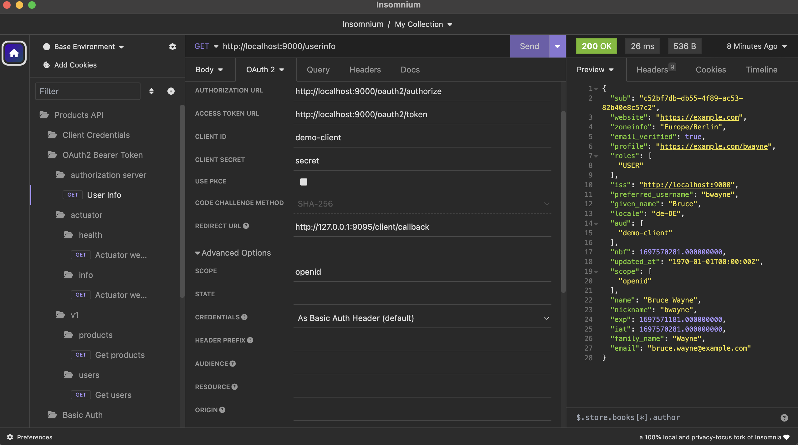
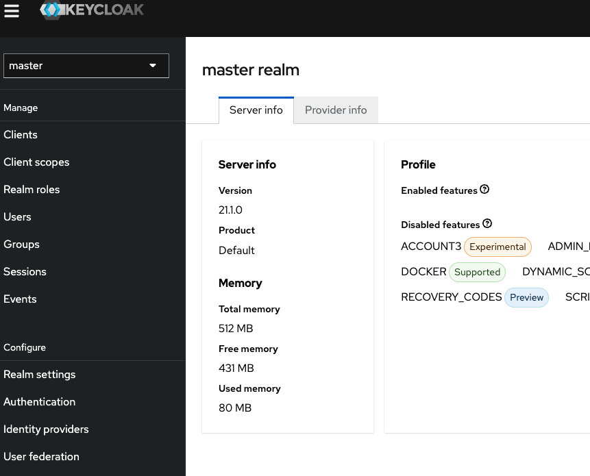
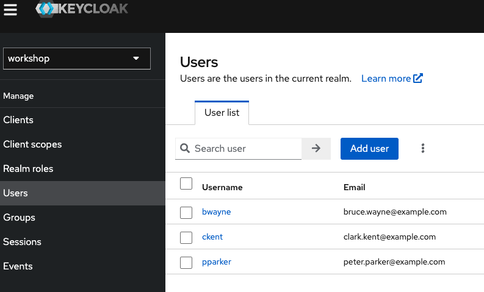
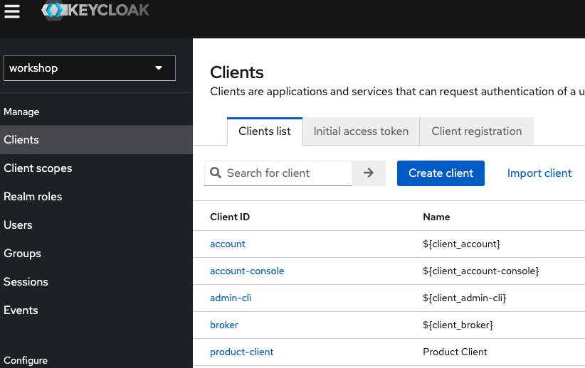

# Setup

You will need these two GitHub repositories:

* All workshop code:  [https://github.com/andifalk/cloud-security-workshop](https://github.com/andifalk/cloud-security-workshop)
* The customized Spring Authorization Server that we will use as identity provider: [https://github.com/andifalk/custom-spring-authorization-server](https://github.com/andifalk/custom-spring-authorization-server)

The __workshop project__ has to be imported as __Maven__ project and the __Custom Spring Authorization Server__ project has to be imported as __Gradle__ project.

Please also follow the instructions in the next sections and also for [Running the Spring Authorization Server](#spring-authorization-server-default). 

## Import the workshop project into your IDE

1. Clone the git repository [https://github.com/andifalk/cloud-security-workshop](https://github.com/andifalk/cloud-security-workshop) or download it as zip file
2. Import the whole directory into your Java IDE as __Maven__ project
   * IntelliJ: File/New/Project from existing sources -> Select directory -> Select __Maven__ in next step
   * Eclipse: File/Import -> Select '__Maven__'/'__Existing Maven Projects__' -> Select directory -> Click 'Finish'
   * Visual Studio Code: Just open the directory with VS Code -> VS Code should automatically configure the project
3. You might have to explicitly trigger an update for the maven configuration to load dependencies (depending on your IDE)

## Run the java applications

All spring boot based java projects can either be run using your Java IDE or using the command line
with changing into the corresponding project directory and issuing a `./mvnw spring-boot:run` command.

In case you need to specify a spring profile you can specify this as environment variable, like with maven (i.e. the `spring` profile):

`./mvnw spring-boot:run -Dspring.profiles.active=spring`

If you run the application inside your IDE then you need to specify it as Java VM environment variable as well: `-Dspring.profiles.active=spring`.

## Postman Collection

To make it easier to test the REST API endpoints of the product service a postman collection is provided in the directory `/setup/postman`.  
If you have not yet installed postman please go to [Postman](https://www.postman.com/downloads/). 
When you have postman installed you can just import the provided collection.

### Using Insomnium

As Postman changed the licensing, so that all collections are always stored in the cloud (in the US for free accounts), this may be a problem for some users.
Unfortunately, the first-class alternative [Insomnia](https://github.com/Kong/insomnia) just went the same way, so cannot save collections locally anymore.
Luckily, there is a new open-source fork still storing collections locally. You can download this application at [Insomnium](https://github.com/ArchGPT/insomnium).

## OpenID Connect Identity Providers

This workshop requires a OAuth 2.0 / OpenID Connect 1.0 compliant identity provider.
There are lots of products available in this area, i.e.:

* [Keycloak](https://keycloak.org) (Open Source IAM by RedHat)
* [Spring Authorization Server](https://spring.io/projects/spring-authorization-server) (Open Source IAM implemented by the Spring Framework community)
* [Auth0](https://auth0.com/) (Cloud based IAM service)
* [Okta](https://www.okta.com/) (Cloud based IAM service)
* [Azure Active Directory](https://azure.microsoft.com/en-us/products/active-directory/) (Well-known cloud-based IAM service by Microsoft)
* [ForgeRock](https://www.forgerock.com/) (Leading IAM product)

This workshop supports the following identity providers:

* [Keycloak](https://keycloak.org)
* [Spring Authorization Server](https://spring.io/projects/spring-authorization-server)
* [Auth0](https://auth0.com/)

In this workshop we will use a customized version of [Spring Authorization Server](https://github.com/spring-projects/spring-authorization-server) as local identity provider.  
[Spring Authorization Server](https://github.com/spring-projects/spring-authorization-server) implements OAuth 2.0 and OpenID Connect 1.0.

You will learn how to run this one in the following section.

> __Optional Lab__: In case you have already finished the lab 1 and lab 2 in short time and you 
> have time left in the workshop, then try to run the applications with one or all of the two 
> remaining identity providers  
> (Additional note: As Auth0 does not need any local installation this would
> be faster than setting up Keycloak locally first). Please have a look in the solution

### Spring Authorization Server (default)

Here we will use a [customized version of the Spring Authorization Server](https://github.com/andifalk/custom-spring-authorization-server). This version contains pre-configured users and registered OAuth/OIDC clients for the sample applications we will use as part of this workshop.

To set up and run the customized Spring Authorizationserver:

1. Clone or download the GitHub repository at: [https://github.com/andifalk/custom-spring-authorization-server](https://github.com/andifalk/custom-spring-authorization-server)
2. Import this project into your IDE as a gradle project
3. After the IDE has configured the project you can start the authorization server by running the main class _com.example.spring.authorizationserver.SpringAuthorizationServerApplication_

#### Check Running Server

The spring authorization server runs on port _9000_. To validate that it is running as expected, please open the web browser and navigate to the [OpenID Connect discovery endpoint](http://localhost:9000/.well-known/openid-configuration).

If you can see the openid configuration in the browser (how nice it is shown depends on your browser addons) then spring authorization server is ready for use in this workshop.

#### User Credentials

You can use the following users to log into the custom Spring Authorization Server:

| User / Password   | Role(s)     |
|-------------------|-------------|
| bwayne / wayne    | USER        |
| pparker / parker  | USER, ADMIN |
| ckent / kent      | USER        |

#### Client- and Server-Configuration

This is the configuration of Spring Authorization Server, Please use these values to configure your client and your resource server:

| Configuration                | Value                                                 |
|------------------------------|-------------------------------------------------------|
| Issuer URL                   | http://localhost:9000                                 |
| Authorization Endpoint URL   | http://localhost:9000/oauth2/authorize                |
| Token Endpoint URL           | http://localhost:9000/oauth2/token                    |
| User Info Endpoint URL       | http://localhost:9000/userinfo                        |
| JWKS / Public Key(s) URL     | http://localhost:9000/oauth2/jwks                     |
| Client ID                    | demo-client-pkce                                      |
| Client Secret                | -- (Uses PKCE)                                        |
| Redirect URI                 | http://localhost:9095/client/login/oauth2/code/spring |
| OAuth Grant Type             | authorization_code                                    |
| Client Authentication Method | none                                                  |

### Keycloak (optional)

To use Keycloak for this workshop, please follow these steps to install and run this identity provider:

1. Download the distribution from https://www.keycloak.org/downloads
2. Extract the downloaded archive (zip or tar.gzip) to a directory of your choice
3. Open a terminal and change directory to the directory you extracted the archive into
4. Create the subdirectory `data/import` and copy the file `workshop-realm.json` from the workshop directory `setup/keycloak` into the `data/import` subdirectory.
5. Change into the `bin` subdirectory of the directory you extracted the archive into
6. Run the command `./kc.sh start-dev --import-realm` or `kc.bat start-dev --import-realm` (depending on your operating system) to start Keycloak
7. Wait until Keycloak has started completely, then navigate your web browser to http://localhost:8080
8. Now let's create an initial admin user, just chose `admin` as both username and password and click create
9. After creating the admin user we can now log into the administration console, just click on the corresponding link and use your admin credentials for the login.
10. Initially, you should see the `master` realm page

11. On the upper left you can change the realm. When starting Keycloak we have imported a custom realm called `workshop`. To switch realms just select the `workshop' realm in the drop-down box.
Next please select the menu item `Clients` on the left. You should see 3 configured user accounts like in the screenshot below.

12. Finally, select the menu item `Clients` on the left. Here you should see the `product-client` in the client list.

Now you are all set with Keycloak. To check the OpenID configuration for this `workshop` realm navigate your web browser to http://localhost:8080/realms/workshop/.well-known/openid-configuration.

#### User Credentials

You can use the following users to log into Keycloak:

| User / Password   | Role(s)     |
|-------------------|-------------|
| bwayne / wayne    | USER        |
| pparker / parker  | USER, ADMIN |
| ckent / kent      | USER        |

#### Client- and Server-Configuration

This is the configuration of the Keycloak `workshop` realm, Please use these values to configure your client and your resource server:

| Configuration                | Value                                                                  |
|------------------------------|------------------------------------------------------------------------|
| Issuer URL                   | http://localhost:8080/realms/workshop                                  |
| Authorization Endpoint URL   | http://localhost:8080/realms/workshop/protocol/openid-connect/auth     |
| Token Endpoint URL           | http://localhost:8080/realms/workshop/protocol/openid-connect/token    |
| User Info Endpoint URL       | http://localhost:8080/realms/workshop/protocol/openid-connect/userinfo |
| JWKS / Public Key(s) URL     | http://localhost:8080/realms/workshop/protocol/openid-connect/certs    |
| Client ID                    | product-client                                                         |
| Client Secret                | -- (Uses PKCE)                                                         |
| Redirect URI                 | http://localhost:9095/client/login/oauth2/code/keycloak                |
| OAuth Grant Type             | authorization_code                                                     |
| Client Authentication Method | none                                                                   |

### Auth0 (optional)

Using [Auth0](https://auth0.com/) for this workshop is quite easy. There is nothing to install.
Just make sure you can access the corresponding OpenID configuration of the Auth0 at https://access-me.eu.auth0.com/.well-known/openid-configuration.

#### User Credentials

You can use the following users to log into Auth0:

| User / Password                         | Role(s)     |
|-----------------------------------------|-------------|
| bruce.wayne@example.com / bruce_4demo!  | USER        |
| peter.parker@example.com / peter_4demo! | USER, ADMIN |
| clark.kent@example.com / clark_4demo!   | USER        |

#### Client- and Server-Configuration

This is the configuration of the Keycloak `workshop` realm, Please use these values to configure your client and your resource server:

| Configuration                | Value                                                 |
|------------------------------|-------------------------------------------------------|
| Issuer URL                   | https://access-me.eu.auth0.com/                       |
| Authorization Endpoint URL   | https://access-me.eu.auth0.com/authorize              |
| Token Endpoint URL           | https://access-me.eu.auth0.com/oauth/token            |
| User Info Endpoint URL       | https://access-me.eu.auth0.com/userinfo               |
| JWKS / Public Key(s) URL     | https://access-me.eu.auth0.com/.well-known/jwks.json  |
| Client ID                    | v13BSQLEZnw4N96V36dDdsGRd022isKe                      |
| Client Secret                | -- (Uses PKCE)                                        |
| Redirect URI                 | http://localhost:9095/client/login/oauth2/code/auth0  |
| OAuth Grant Type             | authorization_code                                    |
| Client Authentication Method | none                                                  |
